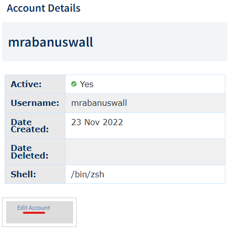

# Linux on the Spartan Cluster

***

## A little background ...

***

#### HPC

*Spartan* is the UoM's high-performance computing (HPC) cluster, and the main place to do primary data processing for bioinformatic tasks. Things like read mapping, homology searches (say, BLAST), phylogenetic inference, genome assembly etc. all need a lot of processors, memory (RAM), and storage (space for saving files). The Spartan HPC cluster provides hundreds of processors, gigabytes of RAM, and Terrabytes of storage.

#### Operating systems and shells

The server runs an **operating system** called *Linux*. An operating system does a lot of stuff. It needs to manage ways to create and access files and directories, run programs, keep track of users, interface with hard disks, communicate with other computers ... etc. It also has to provide you with a way to communicate with it, for example by using text on a screen. The text input and output functionality of the operating system is called a **shell**, because it the "outside" part that the user sees.

You don't need to know how to use Linux yet. During setup, just copy-and-paste the commands given.

The default Linux shell is not very easy to use, so many people have come up with alternative shells to make life easier and generally more fun and colourful. You will use the Z-shell, or *Zsh*, pronounced "Zeesh"! Zsh is great.

#### TTY

A **teletypewriter** (or TTY) interface is a device that provides a screen and a keyboard so you can use this text interface.

... but nowadays, a TTY is just a program. Windows users will use a TTY program called *PuTTy* and MacOS users will use the TTY program *terminal*, which comes with MacOS.

So far, we have this:

> Linux kernel --> Linux shell --> TTY --> User

#### Servers and protocols

Spartan is a kind of virtual computer, made by networking a cluster of different computers together. These are not all in the same place. But the Spartan system links them all together so that when we use them, it works just like it really is one really-really-really-powerful computer. That is the service it offers. And a computer that provides a service, whether it be to run a cluster, to provide storage, or to run a printer, is called a **server**.

Your computer will communicate with the HPC server using a **protocol** (a kind of shared set of rules and conventions, like a common language) called **Secure SHell**, or SSH.

So, to tie it all together so far:

*PuTTy* uses the *SSH* *protocol* to connect to a server and provide a *TTY* interface to a *shell* around the server's *operating system*, which is *Linux*.

Other protocols you may have heard of are SCP (ways of transferring files), HTTP (how browsers talk to servers) and TCP/IP (how information is transferred over networks). Windows users will need to use a protocol called **Secure File Transfer Protocol** (or SFTP) to work with your files on the HPC cluster from your regular desktop environment (and to transfer files between them). The protocol is provided in the program *STFP Drive*. Mac users can use the program *CyberDuck* which does the same thing.

***

## Setup Steps

***

### Download the software

**Windows users:**

1. Get PuTTy from [here](https://www.putty.org/) and install it.

2. Get SFTP Drive from [here](https://www.nsoftware.com/sftp/drive/download.aspx) and install it

**MacOS users:**

1. Get CyberDuck from [here](https://cyberduck.io/download/) and install it.

### Joining the CropGEM HPC project and getting a username

To get access to the Spartan server, you need to join CropGEM's *project*. Ask Tim to send you a request, and you'll get an email at your unimelb address. Another email will arrive to confirm you are a member, and give you a username similar to your UoM login. The CropGEM project is called "punim1869".

### Setting your default login shell to zsh

Head over to [Karaage](https://dashboard.hpc.unimelb.edu.au/karaage/), where you can view and manage your accounts on the university's HPC cluster. Log in with your cluster account password, selecting **unimelb** as your institution.

Click **Accounts** an then your **username**, and on the next screen, **Edit Account**:

... then select zsh from the dropdown menu and click **save**:

### Connecting to the spartan linux server via SSH

**Windows users** (*MacOS users see the bottom of this section*)

1. Open PuTTy

2. In the Host Name box, type `<YOUR_SPARTAN_USERNAME>@spartan.hpc.unimelb.edu.au` 

3. [Optionally] Set the font you want to use in the `Appearance` menu.

4. [Optionally] Set the background and foreground colours you want to use in the `Colours` menu.

5. Back in the `Session` menu, type a nickname for the server into the Saved Sessions box, and click Save. In future, you can connect by double clicking the saved session from the list ...

6. Click Open. You may get a prompt asking about a new connection or a network key. Click yes/ok to either.

7. You have a terminal! It should look a bit like this (but with your choice of colours/fonts) ..

**MacOS users**

Open the program *terminal*.

1. At the command prompt, type `ssh <YOUR_SPARTAN_USERNAME>@spartan.hpc.unimelb.edu.au`. For example, I would type `ssh mrabanuswall@spartan.hpc.unimelb.edu.au`.

2. Enter your spartan password when prompted.

3. The first time you may be asked a question about authenticating a new SSH key. If so, Type 'Y' to confirm.

4. If all goes well, you should connect successfully and see a message similar to the image above.

5. The default terminal colour scheme and font are not very readable or cool. Consider going into the settings and making the terminal your own. A dark background is easier on the eyes.

**Both Windows and MacOS users**

The terminal can be a scary place for beginners. Don't worry. It becomes easy. For now, just copy commands into the prompt as given

8. Install Zsh and oh-my-zsh, using the command:

        cd /home/$USER
        sh -c "$(curl -fsSL https://raw.github.com/ohmyzsh/ohmyzsh/master/tools/install.sh)"

    - HINT: In most terminal apps like PuTTy, you copy text just by highlighting it, and paste it with a right-click.
    - You may get prompts asking you if you want to adopt the default options (YES) and/or change your shell (also YES)
    - Zsh offers a LOT of great features that make your command line experience easier, some of which feature in the Linux [tutorial](./tutorials.html). But you can browse the [cheatsheet](https://www.bash2zsh.com/zsh_refcard/refcard.pdf) for some quick inspiration.

9. Import some customised profile files for Zsh and screen by running these commands (**including** the dot `.` at the end of some commands)

        cd /home/${USER}
        [[ -e .bash_profile ]] && mv .bash_profile .bash_profile_old
        cp /data/gpfs/projects/punim1869/.admin/assets/.bash_profile .
        [[ -e .bashrc ]] && mv .bashrc .bashrc_old
        cp /data/gpfs/projects/punim1869/.admin/assets/.bashrc .
        [[ -e .zshrc ]] && mv .zshrc .zshrc_old
        cp /data/gpfs/projects/punim1869/.admin/assets/.zshrc .
        [[ -e .screenrc ]] && mv .screenrc .screenrc_old
        cp /data/gpfs/projects/punim1869/.admin/assets/.screenrc .
        source /home/${USER}/.zshrc
        mkdir -p /home/${USER}/.Arcitecta
        cat $STO/.admin/assets/.mflux.cfg_template | sed "s/___/${USER}/" > /home/${USER}/.Arcitecta/mflux.cfg
        chmod -R go-rwx /home/${USER}/.Arcitecta

    - Screen is a Linux program you will use later
    - Profile files contain settings for programs in order to customise them. For example, the .zshrc file will change your command prompt to a custom one I designed, and add a few helpful shortcut commands to (e.g.) take you straight to your storage directory.

> You are encouraged to explore and customise your profile files, for Zsh, screen, vim, or any program that uses them. Just as you set up your Windows machine's Desktop background and screensaver and things to make it your own, profiles are how you make your Linux environment into your digital home!

10. Set up some common directories

        mkdir -p /data/gpfs/projects/punim1869/users/$USER/workspace
        mkdir -p /data/gpfs/projects/punim1869/users/$USER/.R_PACKAGES

    - A workspace is a good place to put projects in.
    - If you use R, it's good to have somewhere to store all your packages. Note the dot at the beginning of .R_PACKAGES -- this makes the directory hidden.

### Getting familiar with your new environment

1. If you aren't familiar with Linux and you want to run Linux analyses, time to learn some [Linux basics!](https://www.youtube.com/watch?v=oxuRxtrO2Ag). Find a video or blog or book that suits you. If you are only here to access the shared data or use R, then skip to step 3.
        
2. To look inside the .zsh profile
    - Type `less ~/.zshrc` to read the .zsh profile file. Scroll down with the arrows until you find some lines that begin with `alias`. Have a look and then press `q` to leave the reader.
    - These lines create shortcut commands. For example, the command `samtools view` is what you would use to look at the mapped reads in a .bam file. But it's a lot to type. The line `alias sv='samtools view'` means we can now just type `sv` instead. Here are some others now available:
        - `lincmd` --- Print a list of common Linux commands and command line editing shortcuts
        - `ll` --- List all files with extra data
        - `lll` --- As above, including hidden files
        - `hme` --- Display tasks you are running and the resources they are using (with htop)
        - ... and more, that will come up in other tutorials.
        
3. Storage and your workspace
    - The directory you land in is called your *home directory*. It is basically meant for things like profile files. It does not have much disk space. You should do your work somewhere with more storage space. We have a lot of allocated storage space, and you even have a working directory within it. It is located at `/data/gpfs/projects/punim1869/`.
        - You can get there using the command `cd /data/gpfs/projects/punim1869/`, and list the contents using `tree -L 4`
        - Alternatively, there is an alias set up, `gs` ("[g]o to [s]torage") will take you there.
        - *Alternatively* alternatively, there is a variable set up containing the address, so you can also use (e.g. `cd $STO`).
    - A workspace has been set up for you here. It is in `users/YOUR_USERNAME`. By default, no one else can access it. Use it for ... everything.
        - You can get there with the alias `gw` ("[g]o to [w]orkplace").
        - The address is also automatically stored in the variable $WS.

4. Shared resources
    - Things like reference genomes, that take up a lot of space and which everyone uses, are kept in a shared storage area, located at [project storage dir]/shared_storage. If you need a large file like that, talk to [Tim](mailto: tim.rabanuswallace@unimelb.edu.au) to get it added to the shared storage.
    

5. What now?
    - This depends what you want to do, you could ...
        - [Learn more advanced features and shell scripting](https://www.youtube.com/watch?v=emhouufDnB4), or (a bit more gently) [here](https://www.youtube.com/playlist?list=PLT98CRl2KxKGj-VKtApD8-zCqSaN2mD4w)
        - [Gain familiarity with the convenient functions of Zsh](https://zsh.sourceforge.io/Intro/intro_1.html)
    - Do you want to run bioinformatics programs on spartan? Then you should first learn to [run jobs on the Spartan cluster](./tutorial_slurm_shellscripts.html).
    - Do you want to use R studio on spartan? Read about [how to get set up with R](./tutorial_Rstart.html), and how to become a fierce data analyst with [R::data.table](./tutorial_data_table.html).
    - 
    