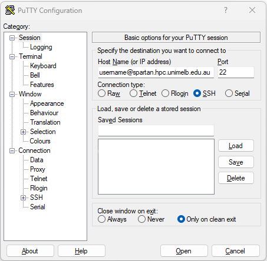

# A little background ...

#### HPC

*Spartan* is the UoM's high-performance computing (HPC) cluster, and the main place to do primary data processing for bioinformatic tasks. Things like read mapping, homology searches (say, BLAST), phylogenetic inference, genome assembly etc. all need a lot of processors, memory (RAM), and storage (space for saving files). The Spartan HPC cluster provides hundreds of processors, gigabytes of RAM, and Terrabytes of storage.

#### Operating systems and shells

The server runs an **operating system** called *Linux*. An operating system does a lot of stuff. It needs to manage ways to create and access files and directories, run programs, keep track of users, interface with hard disks, communicate with other computers ... etc. It also has to provide you with a way to communicate with it, for example by using text on a screen. The text input and output functionality of the operating system is called a **shell**, because it the "outside" part that the user sees.

The default Linux shell is not very easy to use, so many people have come up with alternative shells to make life easier and generally more fun and colourful. You will use the Z-shell, or *Zsh*, pronounced "Zeesh"! Zsh is great.

#### TTY

A **teletypewriter** (or TTY) interface is a device that provides a screen and a keyboard so you can use this text interface.


... but nowadays, a TTY is just a program. You will use a TTY program called *PuTTy*.

So far, we have this:

> Linux kernel --> Linux shell --> TTY --> User

#### Servers and protocols

Spartan is a kind of virtual computer, made by networking a cluster of different computers together. These are not all in the same place. But the Spartan system links them all together so that when we use them, it works just like it really is one really-really-really-powerful computer. That is the service it offers. And a computer that provides a service, whether it be to run a cluster, to provide storage, or to run a printer, is called a **server**.

Your computer will communicate with the HPC server using a **protocol** (a kind of shared set of rules and conventions, like a common language) called **Secure SHell**, or SSH.

So, to tie it all together so far:

*PuTTy* uses the *SSH* *protocol* to connect to a server and provide a *TTY* interface to a *shell* around the server's *operating system*, which is *Linux*.

Other protocols you may have heard of are SCP (ways of transferring files), HTTP (how browsers talk to servers) and TCP/IP (how information is transferred over networks). We will need to use a protocol called **Secure File Transfer Protocol** (or SFTP) to work with your files on the HPC cluster from your regular desktop environment (and to transfer files between them). The protocol is provided in the program *STFP Drive*.

# Setup Steps

## Download the software

1. Get PuTTy from [here](https://www.putty.org/) and install it.

2. Get SFTP Drive from [here](https://www.nsoftware.com/sftp/drive/download.aspx) and install it.

## Joining the CCG HPC project and getting a username

To get access to the Spartan server, you need to join the CCG's *project*. Ask Tim to send you a request, and you'll get an email at your unimelb address. Another email will arrive to confirm you are a member, and give you a username similar to your UoM login. The CCG project is called "punim1869".

## Connecting with PuTTy

1. Open PuTTy

2. In the Host Name box, type <YOUR_USERNAME>\@spartan.hpc.unimelb.edu.au 



3. [Optionally] Set the font you want to use in the `Appearance` menu.


4. [Optionally] Set the background and foreground colours you want to use in the `Colours` menu.


5. Back in the `Session` menu, type a nickname for the server into the Saved Sessions box, and click Save. In future, you can connect by double clicking the saved session from the list ...


6. Click Open. You may get a prompt asking about a new connection or a network key. Click yes/ok to either.

7. You have a terminal! It should look a bit like this (but with your choice of colours/fonts) ...


8. Install Zsh and oh-my-zsh, using the command `` HERE HERE HERE
    + HINT: In PuTTy, you copy text just by highlighting it, and paste it with a right-click.
    + You will get a prompt asking whether you want default options prompts asking you to change your shell.
    + Zsh offers a LOT of great features that make your command line experience easier, some of which feature in the Linux [tutorial](./tutorials.html). But you can browse the [cheatsheet](https://www.bash2zsh.com/zsh_refcard/refcard.pdf) for some quick inspiration.

9. Import some customised profile files for Zsh and screen by running these commands:
    + Screen is a Linux program you will use later
    + Profile files contain settings for programs in order to customise them. For example, the .zshrc file will change your command prompt to a custom one I designed, and add a few helpful shortcut commands to (e.g.) take you straight to your storage directory.
    + You are encouraged to explore and customise your profile files, for Zsh, screen, vim, or any program that uses them. Just as you set up your Windows machine's Desktop background and screensaver and things to make it your own, profiles are how you make your Linux environment into your digital home!
    
```
HERE HERE HERE

```

+    + dots
after


