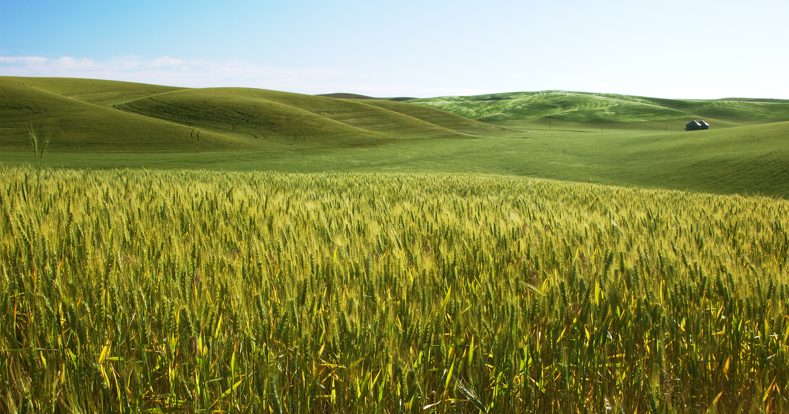

**Welcome to the bioinformatics info portal for the Crop Molecular Genetics workgroup at the University of Melbourne!**

Here you will find resources to help you get started with bioinformatics at CMG, useful links, resources, and tutorials.

---

---

*This page is permanently under construction. For help, contact [Tim](mailto:%20tim.rabanuswallace@unimelb.edu.au)*

