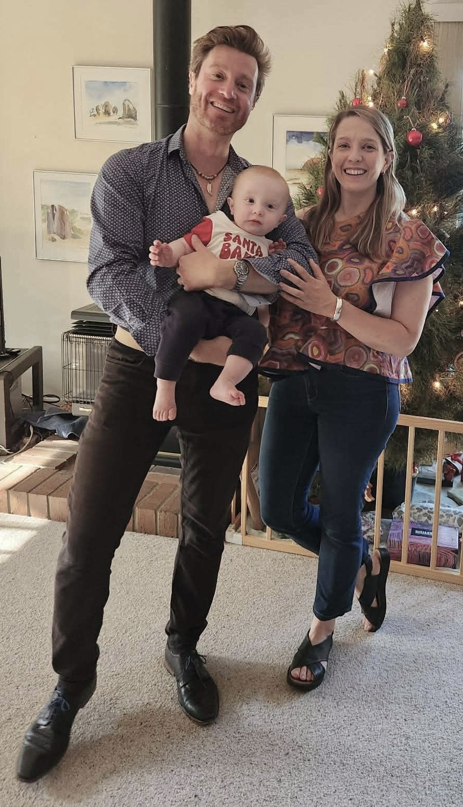
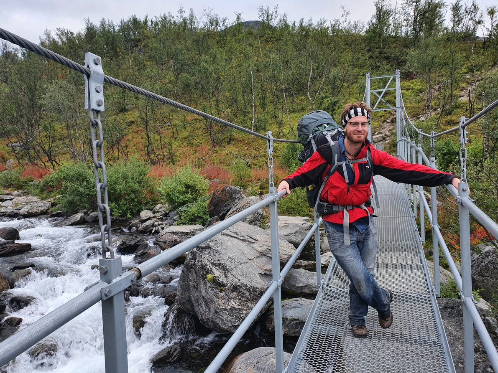
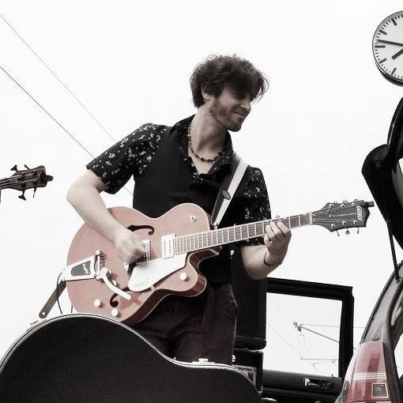
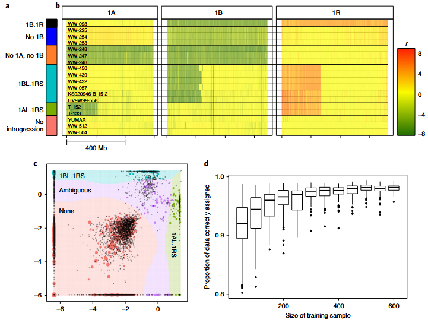
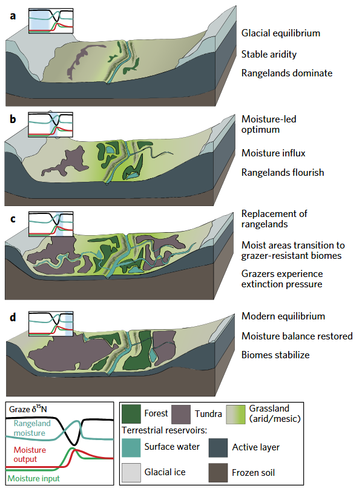
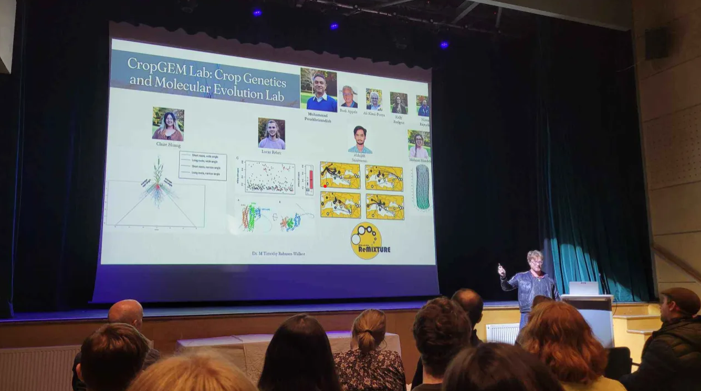
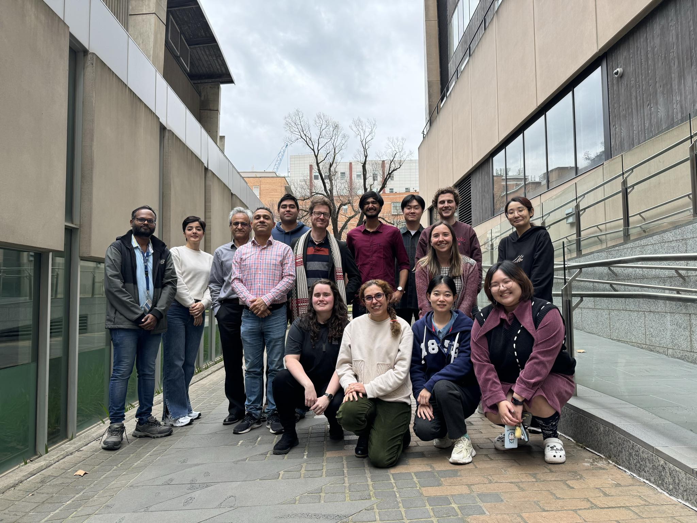

# About me

Call me Tim. I live in Melbourne with my partner Lauren who is also a scientist, and our beautiful baby son Max, whose hobbies include giggling and throwing food. I was born in Adelaide to a German mother and Australian father. Science and nature (plants in particular) have been my passion since I watched by first David Attenborough documentary at age 2. I'm driven by curiosity, the desire to understand the world, to help others do the same, and to apply science to the benefit of humans and the preservation of nature. When not doing science I can variously be found with my family, reading (non-fiction, classics, and textbooks mostly), camping, jamming with a band, working at some woodwork or DIY project at various scales, or (for reasons even I cannot fathom) watching Formula 1.

<div style="text-align: center;">
{width=50%}
{width=50%}
{width=50%}
</div>

# My Science

I'm an evolutionary biologist and bioinformatician, with a special focus on agricultural plants. My PhD in paleoecology and ancient DNA was completed at ACAD in Adelaide. My post-doctoral career began in Germany at IPK. Since attaining an ARC DECRA award in 2024, I been growing a team of wonderful students at the University of Melbourne, in close association with the CropGEM lab. We work on projects that apply evolutionary reasoning to agricultural challenges, exploring them with the help of some creative bioinformatics. I am passionate about mentoring students to help them realise their full creative potential in analysis. I regularly lecture in a few courses and develop R packages including ReMIXTURE and BioDT. I have been privileged to play a lead role several high-profile papers in (e.g. Nature, Nature Genetics, Nature Ecology & Evolution--my first paper!), and to give many talks at international conferences.

## Links

[ORCID](https://orcid.org/0000-0002-4663-985X)

[Scholar](https://scholar.google.com/citations?user=n0phM60AAAAJ&hl=en)

[Github](https://github.com/mtrw/)

[ResearchGate](https://www.researchgate.net/profile/M-Timothy-Rabanus-Wallace)

[University of Melbourne](https://findanexpert.unimelb.edu.au/profile/1016793-tim-rabanus-wallace)

## Research and interests

Some snippets of work I have been/am involved in.

#### Genome evolution and plant pathogen resistance (from Rabanus-Wallace et al., 2025, BMC Plant Biology)
 
<div style="text-align: center;">

{width=70%}

{width=70%}

</div>

<br>

#### Agricultural genomics (from Rabanus-Wallace et al., 2021, Nature Genetics)

<div style="text-align: center;">

{width=70%}

</div>

<br>

#### Cereal/grassland ecology, sustainability, and climate change (from Rabanus-Wallace et al. 2017, Nature Ecolocy & Evolution)

<div style="text-align: center;">

{width=40%}

</div>

<br>

#### Creative bioinformatics and package development

<div style="text-align: center;">

{width=30%}

Visit [github.com/mtrw/ReMIXTURE](github.com/mtrw/ReMIXTURE)<br>

{width=80%}

</div>

<br>

#### Leading, teaching and mentoring

<div style="text-align: center;">

{width=50%}

{width=50%}

{width=50%}

{width=50%}

{width=50%}

</div>

<br>

## Professional Network

I work with researchers from institutions all over the world. Here is a snapshot of some collaborators I have published with or have ongoing projects with. *Hover the mouse over a node to see the details.*

```{r,echo=F,message=FALSE,warning=FALSE}
require(DiagrammeR)
grViz( paste(readLines("data/profNetwork.dot"), collapse="\n") )
```

# CV (exerpts; updated December 2025)


## Academic Qualifications

2018 – **Ph.D. in Evolutionary Biology** (Australian Postgraduate Award)  
*Thesis:* Climate-driven ecological changes through the last glacial period: innovations in plant ancient DNA and stable isotope palaeoecology  
*The University of Adelaide*

2013 – **Bachelor of Science with First Class Honours** (major in evolution and systematics)
*The University of Adelaide*

2008 – **Bachelor of Arts** (majors in philosophy and media communications)
*The University of Adelaide*


## Publications

See my profiles on ...

[ORCID](https://orcid.org/0000-0002-4663-985X)

[Scholar](https://scholar.google.com/citations?user=n0phM60AAAAJ&hl=en)

Some highlights include ...

- *(Co-first author & Major contributor)* Jayakodi et al. (2024) Structural variation in the pangenome of wild and domesticated barley.
**Nature**
- *(Leader & principal contributor)* Rabanus-Wallace et al. (2021). Chromosome-scale genome assembly provides insights into rye biology, evolution, and agronomic potential.
**Nature Genetics**
-	*(Co-first author & major contributor)* Tripodi et al. (2021) Global range expansion history of pepper (Capsicum spp.) revealed by over 10,000 genebank accessions.
**PNAS**
-	*(Leader & principal contributor)* Rabanus-Wallace et al. (2017). Megafaunal isotopes reveal role of increased moisture on rangeland during late Pleistocene extinctions.
**Nature Ecology & Evolution**.
-	*(Major contributor)* Chen et al. (2024) The genetic mechanism of B chromosome drive in rye illuminated by chromosome-scale assembly.
**Nature Communications**
-	*(First author, leader & principal contributor)* Rabanus-Wallace et al. (2025) Do duplication-inducing elements ‘cooperate’ with genes in evolutionary arms races? A case study on cereal crop pathogenesis.
**BMC Plant Biology**
-	*(Leader & principal contributor)* Rabanus-Wallace et al. (2023) Accurate, automated taxonomic assignment of genebank accessions: a new method demonstrated using high-throughput marker data from 10,000 Capsicum spp. Accessions.
**Theoretical and Applied Genetics**
- *(Volume editor)* The Rye Genome (2021), Springer, Rabanus-Wallace & Stein eds.

## Grants and funding

(Attained)

- University of Melbourne SAFES Carer’s Support Scheme ($50,000)
- University of Melbourne Global Collaboration Award 2025 ($14,750)
- ARC-DECRA 2024 ($375,000) Evolution of the ‘dark’ genome
- Australian Postgraduate Award 2013—2017 ($30,000 p.a. infl. adj.) Ph.D. Stipend
- *[Non-lead]* UoM SAFES equipment grant 2023 (~$23,000)
- *[Non-lead]* Chinese Academy of Agricultural Sciences International PhD Student Scholarship (Full PhD stipend). Co-expression and protein co-localisation analysis of genes involved in cereal grain disarticulation
- *[Non-lead]* UoM SAFES equipment grant 2024 (~$76,000). FieldSpec 4 HR spectroradiometer—high throughput and precise evaluation of plant, soil and water properties

(Outcome pending)

- *[Non-lead]* GRDC Funding Call “New technologies for targeted recombination in breeding programs” 2025 ($250,000) Overcoming critical recombination barriers in crop breeding programs using predictive genomics
- *[Non-lead]* GRDC Research Grant 2025 ($250,000) Elevating barley nitrogen use efficiency through exotic genetic resources

## Supervision and mentorship

- One PhD candidate supervised to completion
- Three PhD candidates under supervision (one pending)
- Two masters candidates under supervision (one pending)
- Three academic research assistants

## Project leadership roles

(Current)

- Evolution of the ‘dark’ genome (DECRA-funded; 8 members in 3 institutions in 3 countries)
- Domestication bottleneck consequences in cereals (GRDC-funded, 10 members in 2 institutions in 2 countries)
- ReMIXTURE: Visualising Genetic Population Relationships in Space (UniMelb Funded, 6 members in 3 institutions in 2 countries)
- The conservation and agricultural potential of Australian indigenous grasses (UniMelb Funded; 6 members in 4 Australian institutions)

(Past)

- EU G2P-Sol Consortium Pepper Sequencing Team (50+ total project members in >10 countries, 5 local technical staff)
- International Rye Genome Sequencing Consortium (co-leader; 50+ members in ~10 countries)
- Herbivory-associated growth modulation pilot trial (6 technical staff and 3 academic staff)
- Plus minor leadership roles on more projects than I can list here.

## University-level Education

—present.  
**The University of Melbourne**  
Genetics for Agriculture (AGRI10051), undergraduate level, ~150+ students.  
*Lecture design and delivery. Four lectures per year, plus various contributions to pracs or tutes. Setting of exam questions.*

2023—present.
**The University of Melbourne**
Advanced Plant Breeding and Improvement (AGRI90091), ~100+ students.
*Lecture design and delivery. 1—2 lectures or prac talks per year. Setting of exam questions.*

2018—2020, 2023
**The University of Gottingen**
*Design and delivery of yearly workshops and lectures, including wet lab components with experiments designed from scratch, bioinformatic workshops with packages and functions written specifically for the workshop, setup of a dedicated server environment for students, organisation of transport/accommodation/catering as the students would take the course at the IPK institution over three days, institute tours. Examination/assignment setting and marking.*

2016—2017
**The University of Adelaide**
*Tutoring of indigenous students in ecology, evolution, and basic biology.*


## Communications and outreach

- Frequent addresses and posters at conferences, meetings, seminars etc., including speaking at PAG San Diego seven times.
- Outreach articles in journalistic publications Pursuit and The Scientist.
- Many publications in mainstream media outlets such as The New York Times, The Guardian, Cosmos, The Atlantic etc. have reported on my research, specifically on Jayakodi et al. 2024 *[joint lead author]*, Tripodi et al. 2021 *[joint lead author]*, and Rabanus-Wallace et al. 2017 *[lead author]*.