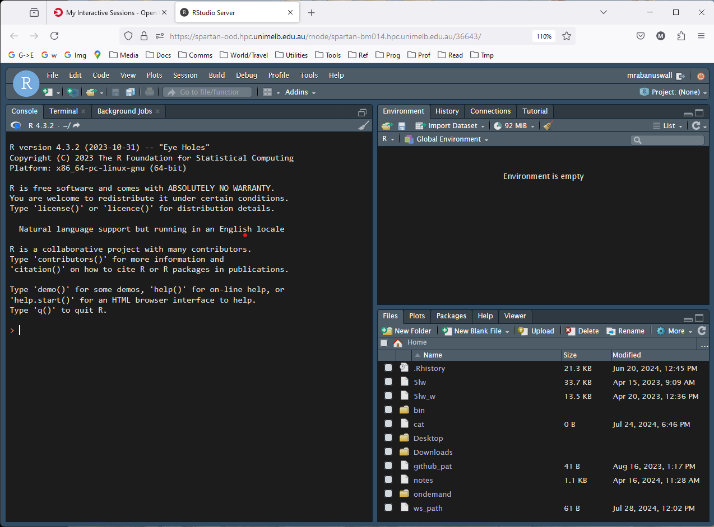
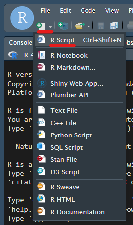
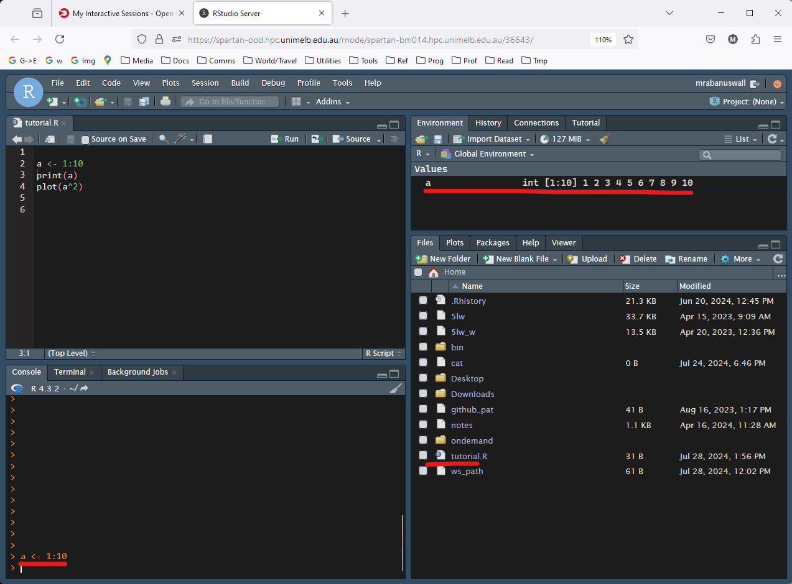
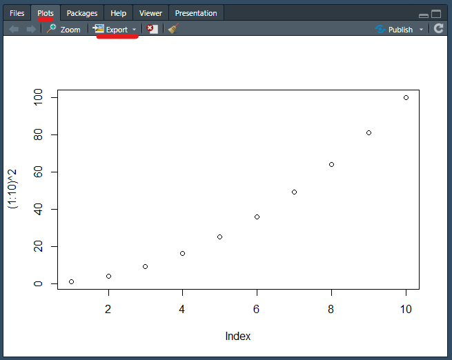
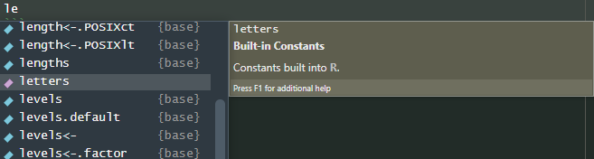
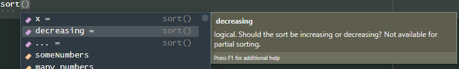
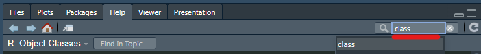
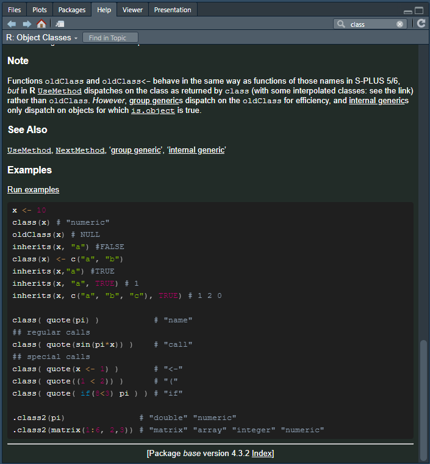
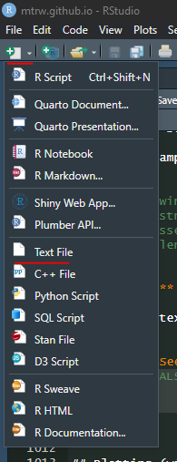
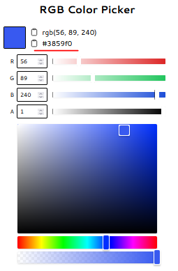

```{r,label=setup,include=F}
require(data.table)
require(magrittr)
options(datatable.print.nrows = 10,datatable.print.topn = 3)
```

---

# Background

### What is `R`?

R is a *programming language*--a way for a human to tell a computer to do things--designed specifically for analysing data, doing statistics, and creating graphics. It is extremely popular, and extremely useful. Users of R can create *packages*, which add new functions to R, and thanks to the existence of several thousand publicly-available packages, R has an incredibly large range of applications. In the field of bioinformatics, R's only main competitor is the language Python, and knowing at least one of these is essential to working as a bioinformatician.

### What makes this tutorial different

There are plenty of R tutorials out there, and even some specific to bioinformatics. Subtly, each reflects the preferences and styles of the writer. You will eventually develop your own style, but your starting point will greatly affect how fast you converge on a style that is optimal for the work you're doing while reflecting your personality. And yes, coding is a very expressive, creative activity and (in my opinion) just as much a means of self-expression as painting or writing music.

This tutorial favours a style that:

- Is **best for bioinformatics**, where *speed* is hugely important.
- **Promotes creative freedom**, by encouraging understanding of all the code at a deep level. The aim is that you are able to express in code any idea that comes into your head. 'Black boxes' are avoided.

To give you a deeper understanding, we spend a while on the fundamentals. Much of what you learn in Part 1, you will not use in everyday code because there are simpler ways to do it using more sophisticated tools. But, when you want to do something *special*, or *creative*, or exceptionally *efficient*, or *new*, you will need to understand these fundamentals. Similarly, knowing your fundamentals means you become far better at using more advanced tools. Errors become less mysterious, results make more sense, customising the tools becomes possible. This tutorial assumes you want to truly learn the R language, not just use it to get one task done.

Lastly, this tutorial focuses on **concepts**. It does not waste time forcing you to learn every single tiny feature and function in R. The best way to find and understand specific features you want to use in your work is to find code written by more experienced people who have done a task similar to yours before, and learn from it---but once you've finished these tutorials, the code you read from other people and from internet searches will make much more sense and be much faster to absorb and modify.

### Dazzling data.table and the tidyverse tyranny (do decide to to dump dplyr).

R's basic functionality can be expanded using *packages*--think of plugins for browsers or apps for a phone. Some packages fundamentally change the way you write R code. The developers of R and R studio have developed a collection of packages known as the *tidyverse* packages. They are immensely popular, partly because they are easy to use, and partly because the developers of R and Rstudio have a natural advantage in 'influencing' (or ... monopolising?) the way people code.

Unfortunately, the tidyverse way of coding is neither the optimal for bioinformatics, nor is it the best for creativity.

The package `data.table` is a far better option for bioinformatics and in general (in my opinion). Compared to tidyverse methods, it is much faster, saves memory, and most importantly you can describe extremely creative and complex ideas in a very simple way. It takes a tiny bit longer to learn the basics--maybe two full days compared with one full day. But it is worth it. There is a special tutorial on `data.table` waiting for you once you finish this one, [here](tutorial_data_table.Rmd).

### How to do this tutorial

1) Don't just read. Write and run all the commands yourself. If you miss one, others later may not run. Most importantly, *play with the commands*. Change things around, try new things, connect ideas together, try to break the commands, then figure out why ([searching the web](www.duckduckgo.com) might help).
2) This is about learning the fundamentals. Don't load any packages. Do **NOT** under any circumstances load `dplyr`, do **NOT** use `select`, `filter`, `arrange`, `mutate`, or any of those silly things. 
3) If you get stuck or you want to dig into a topic for greater understanding, first try R's inbuilt help functions (see below). Web searches can also be great, but be aware the answers vary a lot in quality. There is also ... 
4) ChatGPT (and other generative LLMs), which needs a short discussion ...
    - **DON'T** *use chatGPT to write code for you*, especially while you are learning. It generally produces awful code. In particular, it has been trained on code it finds on the internet, and it cannot distinguish good code from bad code. Since most code on the internet is bad, that is what it produces. It relies excessively on loading obscure packages to perform tasks that can easily and quickly be done with standard functions, it wantonly and wastefully converts data between different formats, makes inefficient choices, and worst of all, it makes it very tempting to run code you don't actually understand and couldn't write yourself.
    - **DO** *use chatGPT to read the manual for you*. Once you already know some R, use chatGPT to remind yourself of bits you can't remember or haven't discovered yet. You will find yourself thinking "I'm sure there is a function to do this, but I don't know what it is!" That's a great time to ask chatGPT for help. Ask it for example:
        - "What are the parameters that control the size and type of points in a scatterplot in base R?"
        - "How can I check whether a file exists in R?"
    - **DO** *use chatGPT to explain functions or code to you*. Excellent uses of chatGPT are questions like
        - "Please break down this line of R code: 'm %<>% apply( 1 , function(x){x/sum(x)} )'"
        - "In the R code 'frank(x,ties.method='dense')', what does the 'dense' argument mean?"

> A good rule-of-thumb is that chatGPT is something you show code *to*, not something you get code *from*, especially not whole lines or multiple lines of code.

---

# Part 1: R fundamentals


---

## Starting an R session on Spartan

If you haven't already, start an R session by following [these](tutorial_Rstart.html) instructions.

---

## Creating and running commands in your first R script

You will start with a screen like this ...



First thing, create a new *script* using this button. A script is just a text file you use to save R *commands* that achieve some task. Use `<ctrl> + s` so save, and name it, say, *tutorial.R*.



To test things are working, type the following into the script:

```{r,eval=FALSE}
a <- 1:10
print(a)
plot((1:10)^2)
```

Each of these lines is a command. Let's run the first command. Highlight the command using the mouse, then run it using `<ctrl> + <return>` (aka `<ctrl> + <enter>`).

You should see this:



Notice:

- The command appears in the lower left window. This is known as the *R console*. It is analagous to the linux command line, except running R. It is both where commands are inputted, and where much of their results are outputted. You can always type commands directly into the console, but the trick using `<ctrl> + <return>` is a far more convenient way to work.
- In the top right under the 'Environment' tab, the value "a" is recorded. This will make more sense later.
- In the lower right under the 'Files' tab, we can see the contents of our home directory, including our script. This is simply a file browser, and is immensely useful.
        
Now run the second command a different way. Instead of highlighting the command, simply place the cursor on the same line, and hit `<ctrl> + <return>`. Notice it sends the whole line to the console. This is the most common way to run commands. We use the highlighting trick when we want to run just small parts of larger commands.

Notice:

- The console now contains the command, and also some *output*, the numbers 1--10, probably in a different colour to the command. this is the result of the command we sent it.

Run the last command, which creates a plot. If it works ok, you will see a plot appear in the lower right window, which will automatically switch to the 'Plots' tab.  



Look for the button labelled "Export". This is one way to save plots you create as images or vector graphics. Try it if you want.

---

## Basic operations and operator precendence

Some of the most simple commands in R perform basic maths. Play around with running these.

```{r,eval=FALSE}
1+3
8/2
88398.7493 - 72992
1.3e5 + 1
```

Notice the last one uses scientific notation.

Try to guess the output of this before you run it:

```{r,eval=FALSE}
3+2/10
```

Notice it did the division first, which is conventional according to BEDMAS. In programming talk, we say the division operator (`/`) has higher *precedence* than the addition operator (`+`).

We can control the order of operations using brackets:

```{r,eval=FALSE}
3+2/10
(3+2)/10
((3+2)/10**2)
((3+2)/10)**2
```

The double asterisk (**) does exponentiation (raising to a power). The carat symbol (^) also works.

---

## Comments

Any command that begins with a hash (`#`) will not be run. These are known as *code comments* and are what you use to include helpful notes in your script. They are immensely important when writing good code. They can also be very funny. The most famous code comment ever written is "/* You are not expected to understand this */" which was [part of the UNIX operating system](https://thenewstack.io/not-expected-understand-explainer/?utm_referrer=https%3A%2F%2Fwww.linux.com%2F).

If the hash occurs within a line, everything to the right will not run.


---

## Variables, vectors, and vectorised functions

What did the command `a <- 1:10` do? We can find out with some experimentation. Highlight only the `1:10` part of the command and have a look at the output:

What did our previous command do? Try highlighting only the `1:10` part and running that with `<ctrl> + <return>`:

```{r,eval=FALSE}
1:10 # produces 1, 2, 3, ... , 10
```

Great! We have a "list" of numbers from 1 to 10. Such lists of things are called *vectors* and are fundamental to R. The colon (`:`) is a shortcut for creating vectors of concurrent integers.

**Exercises:**

- Try using the colon operator to create a vector numbers from 201 to 1002.
- Then try making a list of numbers that goes backwards, starting on a positive number, and ending on a negative number.

<details>
<summary> **See answers:** </summary>
```{r,eval=F}
201:1002

6:-2
```
Answer

</details>

---

## Variable assignment and printing

The command we ran, though, had two more components: `a` and `<-`.

The symbol `a` here is a user-chosen name given to a *variable*, a kind of "box" that holds particular values (in this case, the vector of integers 1 to 10), and referred to by the label `a`. The `<-` symbol takes whatever is produced by the code on its right, and stores it in the box labelled whatever is on the left.

The variable name can them be used in code to provide the value it contains. Play around with that idea until it feels comfortable, e.g. ...

```{r,eval=FALSE}
a <- 3
a # Running a variable name by itself outputs the contents in the console
a + 5
a + a
b <- 2
a + b
c <- a / b
c * 7
```

**Exercises:**

- Guess a way to assign the value 2 to *two* variables named 'a' and 'b' using just one line of code ...

<details>
<summary> **See answer:** </summary>
```{r,eval=F}
a <- b <- 2
a # prints 2
b # ... same
```
</details>

- In the above example, if you change the value of 'a', will that affect the value of 'b'? To find out, try increasing the value of 'a' by 1. Do it in such a way that it would work no matter what value 'a' contains.

<details>
<summary> **See answer:** </summary>
```{r,eval=F}
a <- a + 1
a # prints 3
b # prints 2. No!--changing b does not affect a.
```
</details>

---

## Vectorised operations

Now we have seen a few operations like `+`, `*`, etc. working on numbers, and we know how to create a vector using `1:10` containing the numbers 1, 2, 3, ..., 10, we may well ask what happens when we do these operations on a vector.

**Exercise: (using numeric vectors e.g. `1:10`)**

- Work out what happens when you add a single number to a vector of length 10.
- Try the same with the operands swapped. Is the result the same?
- Work out what happens when you add a vector of length 10 to itself.
- Create two vectors of length 10, and divide one by the other.
  - Try including a zero in the denominator vector. What happens when you try to divide by zero?
- Subtract a vector of length 10 from a vector if length 3. What happens?
- Subtract a vector of length 10 from a vector if length 2. What happens?
  - Try this with the operands reversed. What happens?

<details>
<summary> **See answer:** </summary>

Here are some examples of commands that fit the exercise, and the answers as comments:

```{r,eval=F}
1:10 + 5 # The single value is added to each element of the vector

5 + 1:10 # Same result

v <- 1:10
v + v # Each element in the left hand operand is added to the corresponding element in the right hand operand.

w <- 10:1
v/w # As above. The results are decimals.

w <- 0:9
v/w # When dividing by zero, we get the special value 'Inf' meaning 'infinite'.

x <- 1:3
v-x # Error! "In v/x : longer object length is not a multiple of shorter object length"

y <- 1:2
v-y # Interesting. We get `0 0 2 2 4 4 6 6 8 8`. Discussed below.

y-v # We get `0  0 -2 -2 -4 -4 -6 -6 -8 -8`.
```
</details>

So, if we think about those results a bit we an arrive at a few general rules:

1) The results are given by 'lining up' the vectors and running the operation on each pair of *elements* (or "members" of a vector):

```
Command:
---------
1:4 + 5:2
---------


Calculations:
-------
1 2 3 4
+ + + +
5 4 3 2
-------

Result:
-------
6 6 6 6
-------
```

2) If one vector 'runs out' of elements, it is repeated (or as it is known, *recycled*):

```
Command:
---------
1:4 + 2:3
---------


Calculations:
-------
1 2 3 4
+ + + +
2 3 2 3
-------

Result:
-------
3 5 5 7
-------
```

3) The length of the shorter vector must divide into the length of the longer one.

*Vectorised* operations--operations that work on vectors following these rules--are really at the heart of R, and are the main reason it is so powerful as a statistical language.

All these rules extend naturally to operations on more than two vectors.

**Exercise:**

- Use what you know about **vectorised operations** and **precendence** to carefully predict what these functions will do before you run them. Note that `*` has precendence over `+`.

```{r,eval=FALSE}
1:4 * 1:6 + 1:12
1:4 + 1:6 * 1:12
```
- Add brackets to one or both commands to make them both work.

<summary> **Get help with the answer:** </summary>
<details>
Try running sub-parts of each command separately, e.g. `1:4 * 1:6` and `1:6 + 1:12`. Ask yourself which will be run first, given the precendence rules. Note the length of the outputs, and think about how they will be recycled in the context of the whole command.
</details>

---

## Vector classes

Different kinds of data or information needs to be stored in different ways. A list of SNP positions is a collection of integer numbers, while a list of plant heights in centimetres will be a decimal number. A list of sample ID codes is probably strings of text, while data on whether a plant belongs to the control group might suit a TRUE/FALSE format. R has different kinds (or *classes*) of vectors to cover all these cases.

Later, we will learn how these can be connected together into tables, a bit like spreadsheets. But first we need to master the basics of the different types of vector and how to work with them.

### Integer & numeric

We have already worked with vectors containing integers (-1, 0, 1, 2, 3, ...) so far, and we have seen that vectors with decimals can also exist.

These two types of vector *classes*---*integer* and *numeric*---are actually different. Behind the scenes, it takes more memory to store decimal numbers, and performing operations on them takes more calculations (more info for the perplexed (here)[https://matloka.com/blog/floating-point-101]). But they can store not only decimals, but far larger numbers than integer vectors can. By default, R assumes we are happy with integers wherever possible, and will silently convert vectors to numeric types when necessary.

### Character

We haven't yet seen character vectors. R actually loads a variable containing a character vector automatically when it starts, the variable `letters`. This is what it contains.

```{r}
letters
```

Not surprising. Notice all the entries are in quote marks (`"..."`), which tells R you are dealing with character types. Consider the following to see why that's important:

```{r,eval=F}
a <- 3
b <- a
c <- "a"
```

Here, `b` contains 3, which is an integer that was copied from the *variable* `a`. But `c` contains the *character* "a", which R knew because we put it in quote marks.

### Logical

One of the most important vector types stores the values `TRUE` or `FALSE` (or `NA`). They are truly fundamental in R and we will see more of this in the section on logical operations.

---

## Special values including 'NA'

As we saw when dividing by zero, some calculations don't result in a 'normal' value, and R accommodates this.

Some special values include "Inf" and "-Inf" (infinite, or negative infinite), "NaN" (not-a-number), and "NA" (not applicable, invalid). We can indeed use special values ourselves. Here are examples of times when they are generated:

```{r,eval=FALSE}
1/0 # Inf

0/0 # NaN

log(0) # -Inf

Inf/-Inf # NaN
```

The value 'NA' is not produced by any simple operation, but is extremely common as it is often used to denote missing data. We will learn how to deal with it in time. For now, note that most operations with 'NA' in them will produce either an error or 'NA'.

```{r,eval=FALSE}
NA + 1 # produces NA
1:NA   # produces an error: "Error in 1:NA : NA/NaN argument"
```

---

## Running functions

If we wanted to calculate the sum of all those numbers we can use a *function* called 'sum'.

```{r,eval=FALSE}
numbers <- 1:10 # Notice we use 'numbers' as the variable name, which is far more intuitive than 'a' or 'b' etc.
sum(numbers)
```

Functions always have the syntax `FUNCTION_NAME( ... )`, where the '...' represents information the function needs to work.

Functions typically take some *object* (like a vector or a list or a data.frame--things we will cover later) or a collection of objects, do some processing, and *return* some other object. For example, all these simple functions take a vector object and return a single number. Note though, that in R, a single number is in practice simply a vector with a length of 1.

Try these:

```{r,eval=F}
many_numbers <- -100:100 # Variable naming using words separated by underscores is a convention called snake_case. The main alternative is camelCase in which capital letters indicate new words. mixedCase_isAlsoUsed. Some people like to police which should be used in what scenario but I think you should do what feels right to you.
sum(many_numbers)
length(many_numbers)
max(many_numbers)
min(many_numbers)
prod(many_numbers) # product
mean(many_numbers)
var(many_numbers) # variance
sd(many_numbers) # standard deviation
median(many_numbers)
```

The `class()` function will explicitly tell you which class(es) an object is ... as a character vector.

```{r,eval=FALSE}
class(1:3) # integer
class(1.24212) # numeric
class(1.0) # numeric. Notice that including a decimal point is a way to enforce that values you define are numeric
class(0:4 + 0.0) # numeric ... Even though 0:4 is an integer vector, the `+ 0.0` forces R to convert the whole thing from an integer into a numeric vector.
```

Other functions return vectors. For example, try:

```{r,eval=FALSE}
someNumbers <- -5:5 # Camel case! Because the capital letters look like the humps on a camel, of course.
log(someNumbers) # The natural logarithm. A vector the same length as the input. Notice the special values.
log10(someNumbers) # The base-10 log
sin(someNumbers) # sine
acosh(someNumbers) # hyperbolic arc-cosine. I've never used it but good to know it exists.
abs(someNumbers) # Absolute (positive) value

sort(someNumbers) # A vector the same length as the input.

range(someNumbers) # A length 2 vector containing  the maximum and minimum values
```

Others return more obscure objects:

```{r,eval=FALSE}
summary(someNumbers) # A 'table'-class object
```

... and yet others, such as `plot()`, don't produce any output on the console, but perform some other task. Other examples include `dir.create()` which creates directories and `read.csv()` which reads data from .csv files.

---

## Arguments

Functions can sometimes take more than one *argument*. The word 'argument' in programming strictly describes bits of information (or objects) that are given to a function or a program:

```{r,eval=F}
max(1:4,5:10) # 10
range(1,58,-1777) # -1777, 58
```

These examples just run the same talk across all inputs. A more common case is that the different arguments contain different bits of information about how the function should run.

```{r,eval=F}
sort(1:5,TRUE) # 5, 4, 3, 2, 1
sort(1:5,FALSE) # 1, 2, 3, 4, 5
```

So, the TRUE and FALSE here appear to be the answer to the question "should I sort this list in decreasing order?"

### Named arguments

Since this gets very confusing as more arguments are added, R's arguments have names. We could have written the above command this way:

```{r,eval=FALSE}
sort(x=1:5,decreasing=TRUE)
```

So, the argument giving a vector of inputs to sort is called 'x', and the argument saying whether or not to sort in decreasing order is called 'decreasing'. A single equals sign (`=`) is used for argument assignment. It is possible to use the single equals for variable assignment too, but you shouldn't, and if I catch you doing it then you have to buy me a Snickers bar. That's how it works.

### Default arguments

Not every argument a function has needs to be given to it. When we run `sort(10:2)`, it does not ask us whether we want 'decreasing=TRUE' or 'decreasing=FALSE'; It just assumes decreasing=FALSE. In this case, we say that the *default* argument of 'decreasing' is FALSE. Some arguments don't have defaults, and these must be given or else an error message will tell you an argument is missing. Most functions require only one input, and the defaults of any remaining arguments are chosen to suit the most common usage.

How do you know what arguments a function needs, and what its defaults are? There are two ways, and they are the next two topics ...

---

## Autocomplete and other IDE shortcuts

In R, you end up typing the same things a lot. The IDE (Rstudio) will guess the ending of a lot of half-typed things, when prompted by the `<TAB>` key. For example, we know the variable 'letters' exists. Just type ... `le` ..., leave your cursor at the end and hit `<TAB>`. You will get a scrollable, clickable, list of possible autocompletes:



These may even bring up more help info when you highlight them. If there is only one option, it will be filled automatically. Otherwise select one with arrow keys or mouse and press `<RETURN>` or click to insert it. Easy.

If you are writing a function, you can also use `<TAB>` to list the arguments. To try it out type the function name and brackets, put the cursor *inside the brackets*, and `<TAB>` ...

```{r,eval=F}
sort()
```



And suddenly you have a list of valid arguments with (usually) descriptions, indicated by the purple symbol on the left.

---

## HELP!!!

If you want even more help with a function or another object, many come with manuals. You can search the function name here on the lower right panel:



Or you can run the function name preceded by a `?` symbol:

```{r,eval=F}
?class
```

... which will give you a help document containing (most importantly), descriptions of the arguments, and examples, which are usually very helpful.



---

## Creating vectors

The function that creates vectors is simply called `c()`, short for "combine" (but I think of it as "create"). For example:

```{r}
v <- c("this","character","vector","has","six","entries")
v
```

These demonstrate the use of c to combine vectors, and how R will convert between classes to accommodate the input classes. Try guessing the classes of these before you run them ...

```{r,eval=FALSE}
a_integer <- 1:3
b_numeric <- c(1.0,-4.543)
c_character <- LETTERS

(a_b <- c(a_integer,b_numeric)) # Notice the extra set of brackets around the whole command? This is a cool trick that tells R to print the result fo the assignment
class(a_b)

(a_b_c <- c(a_integer,b_numeric,c_character))
class(a_b_c)
```

**Exercises (including some lessons about arguments):**

- Use `c(...)` to create a vector containing the entries 1, -4.3623, 3e6, Inf, NA, NA, and 1/3. Store it in a variable named using the camelCase convention.
- What would have happened if you had enclosed the first value (1) in quotes, as in ("1")? Would this also affect the other values in the stored vector?
- Try to calculate the minimum of the vector using the `min()` function. Don't type the whole name of your vector--try using autocomplete (`<TAB>`) to help you. What result do you get?
- Explore the arguments to `min()` using `<TAB>` as above, or the help documentation. Find an argument that will make the function ignore 'NA' values when calculating the minimum.
- Find two more ways that use a function to give you the minimum value in the vector (it's ok if it tells you other stats too). Three such functions have already come up in this tutorial.
- Use the function `log()` to calculate the natural log of something. Then, give it a named argument that changes it to base 2. Finally, give it a named argument like `beans=...`, that doesn't exist. What happens?
- Run your log-base-2 function again, but delete the argument names (just leave the values, separated by commas), which will make R guess which value belongs to which argument. Does it still work?
- Change the order of the values. Does it still work? Does providing argument names to one or more of the values help R to guess?

<summary> **Answers:** </summary>
<details>

```{r,eval=FALSE}
thisIsMyVector <- c(1, -4.3623, 3e6, Inf, NA, NA,  1/3)

c("1", -4.3623, 3e6, Inf, NA, NA,  1/3)
# "1" would be interpreted as a character string, and as such a character vector would be produced, with all the other values would being converted to character strings. This is because it is simple to convert other classes to character strings, but not always the other way around. For example, the character representation of an integer like 64917 can be "64917", but there is no obvious integer representation of the string "beans!".

min(thisIsMyVector)

min(thisIsMyVector,na.rm=TRUE)

summary(thisIsMyVector)
range(thisIsMyVector,na.rm=TRUE)

log(42.0)
log(42.0, base=2.0)
log(42.0,2.0) # Yes, that does work, it produces the same result as above.

log(2,42) # That's not what we wanted
log(base=2,x=42) # That works
log(2,x=42) # That also works
log(base=2,42) # And that works too.
```
</details>

As you can see, R is good at connecting the correct values to the correct arguments. It basically follows the rule assign all named values first, then go through the unnamed values in order and connect them to the remaining unnamed arguments, in order.

### Vector-creating functions: rnorm and friends

In statistical analysis, you'll often want to generate random numbers, and we'll use these to demonstrate more of R. Here are a few functions to do it.

```{r,eval=FALSE}
# 20 random integers between 1 and 10
sample(x = 20, size = 10)

# 20 random real numbers between -1 and 1
runif(n = 20,min = -1,max = 1)

# 20 normally-distributed numbers with mean 0 and standard deviation 0.5
rnorm(n = 20, mean = 0.0, sd = 0.5)

# Similarly, these and others:
# rbinom(...)
# rpois(...)
# rbeta(...)
# rchisq(...)
# rweibull...()
# rcauchy(...)
```

---

## Indexing vectors

Extracting elements of a vector can be done with the square brackets (`[` and `]`). If we place a vector of numbers inside the brackets, then the numbers will be taken to represent the *indices* (singular: *index*) of the vector, i.e., 1 is the first element, and 2 is the 2nd, etc.:

```{r}
poem <- c(
  "There", "are", "holes", "in", "the", "sky", "where", "the", "rain", "gets", "in",
  "but", "the", "holes", "are", "small", "that's", "why", "rain", "is", "thin"
)
# Notice I spread the command out over a few lines to make reading easier. If a line ends with a bracket still open or a command otherwise unfinished, it will assume you have a multi-line command.

poem[3] # "holes"

poem[c(1,10,2,12)]

poem[1:11] # "There" through to "in" 

poem[12:length(poem)] # From "but" to the end
```

**Exercises:**
- With the vector 'poem' above, use indexing to produce a vector containing the words of the poem above, backwards.
- Research the `seq()` function. Use `seq()` in conjunction with indexing, to produce a vector with every second word of the poem.
- Use an appropriate random vector generating function in conjunction with indexing to shuffle the words of the poem randomly.
<details>
<summary> **See answers:** </summary>

```{r,eval=F}
poem[length(poem):1]
poem[seq(from=2,to=length(poem),by=2)]
poem[sample(length(poem),length(poem))] # FYI, sample is a flexible function, you could also just do this: `sample(poem)`
```
</details>

This poem is by Spike Milligan, incidentally.

### Logical vectors for indexing

Another way to index is with logical vectors. Consider the following:

```{r,eval=FALSE}
v <- c( "A" , "B"  , "C" , "D" )
l <- c( TRUE, FALSE, TRUE, TRUE)
v[l] # "A", "C", "D"
```

As we can see, the elements of 'v' corresponding to the TRUE elements of 'l' were selected.

R has shortcuts for TRUE and FALSE: You can just use T and F. Use these cautiously as people often use these as variable names:

```{r,eval-FALSE}
c(T,F) # Produces TRUE, FALSE
T <- 1234 
c(T,F) # Produces 1234, 0 --- not what we wanted!
rm(T) # This removes the variable T, so we are safe to use T and F as TRUE/FALSE again
c(T,F) # TRUE, FALSE

#TRUE <- 3 # This is not allowed, and will generate an error (try it!), so using TRUE is always safe
```

**Exercises:**
  - Create a vector containing the letters C---J. Create it by using R's pre-defined vector LETTERS, in conjunction with indexing. Name this vector 'L'.
  - Use a logical vector and indexing to extract the letters C, E, and F.
  - Try selecting elements using a logical vector of length 4. Play around if necessary. What happens? What is the word for the process that happens? (We have seen it before and it begins with an "R" ...)
  - Use logical indexing and the above r-word to extract every second letter from the vector 'L'.
<details>
<summary> **See answer:** </summary>

```{r,eval=F}
L <- LETTERS[3:10]

L[c(TRUE,FALSE,TRUE,TRUE)] # The indexing vector is RECYCLED, that is, it is repeated.

L[c(FALSE,TRUE)]
```
</details>

---

## Logical operations

Some of the most fundamental operators in R involve asking yes/no questions of vector elements. Some of the simplest are the 'greater than' (`>`), 'less than' (`<`), and 'equal to' (`==`) operators:

```{r,eval=FALSE}
v <- -3:3 # -3 -2 -1 0 1 2 3
v > 0 # TRUE TRUE TRUE FALSE FALSE FALSE FALSE
v < 0 # FALSE FALSE FALSE FALSE TRUE TRUE TRUE
v == 0 # FALSE FALSE FALSE TRUE FALSE FALSE FALSE 
v != 1 # Try it. != means "is not equal to". Many programming languages associate `!` with "not"
v_notEqual_zero <- v != 0 # We can save the results in a variable
print(v_notEqual_zero) # TRUE TRUE TRUE FALSE TRUE TRUE TRUE
```

Notice the equality operator is a *double* equals sign, to distinguish it from the argument assignment operator.

### AND , OR, NOT, ...

Often we want to combine the results of logical operations, for example asking whether elements are less than 3, **AND** greater than 1. For this we use the 'and' operator (`&`).

```{r,eval=F}
( v <- seq( from = -3, to = 3, by = 0.2 ) )
v < 3 & v > 1
```

Other useful logical operators that correspond to everyday language concepts are 'or' represented by a pipe symbol (`|`) and 'not', represented by a bang symbol (`!`). In programming we refer to the exclamation mark as bang. If you (understandably) find that offensively abstruse, prepare yourself to eventually encounter the `?!` construct called an **interrobang**.

```{r,eval=F}
( v <- 1:3 )
v < 2 | v == 3
v != 1 & ! v > 2
```

This can get very tricky. To avoid ambuiguity, brackets can be used. For example, imagine asking which entries are either:
- Greater than three and less than six
~ *OR* ~
- Less than two and not equal to 0

```{r,eval=F}
v <- -10:10
(v > 3 & v <6) | (v < 2 & !(v==0) ) # v!=0 would also work
```

It is more common to leave out the middle step though, as in ...

```{r}
v <- rnorm(100)
v[v>0]
```

And one last thing, the very common function `which()` tells you **which** entries of a logical vector are TRUE. So `which(c(TRUE,FALSE,TRUE))` will return the vector ( 1 , 3 ), because 1 and 3 are the indices of the TRUE entries. Based on this, explain to yourself why the two commands below produce the same result:

```{r, eval=FALSE}
v <- rnorm(10)

v[v>5] # a logical vector
v[which(v>5)] # the same logical vector ... why?

# Look, I know you are thinking "actually ... `which` seems pointless". And yes, which() is often pointless. But it is extremely common, and so you need to know it to read other peoples' code.
```

**Exercises:**

- Create a vector 'v' containing 20 numbers drawn from a normal distribution with a mean of zero.
- Create logical vector telling you which values of 'v' are greater than one standard deviation above the mean, and use it to produce a vector containing only those values of 'v'.
- Using one command only, make a vector of values from 'v' that are within standard deviation of the mean, either above *or* below.
- Modify the above command to return the *range* of the values from 'v' that are within standard deviation of the mean.

<details>
<summary> **See answer:**</summary>

```{r,eval=F}
( v <- rnorm(20) ) # Remember, surrounding the assignment command in brackets forces it to print

( vPositive <- v > 0 )
v[vPositive]

vGt1SD <- v > ( mean(v) + sd(v) )
v[vGt1SD]

v[ (v > ( mean(v) - sd(v) )) & (v < ( mean(v) + sd(v) )) ]
v[abs(v-mean(v)) < sd(v)] # Or alternatively ...

range( v[abs(v-mean(v)) < sd(v)] )
```
</details>

Last thing! If you use `sum()` on a logical vector, it will count the 'TRUE's. Very useful. In general, if you use logical vectors in functions that usually expect numbers, then they will treat TRUE and FALSE as 1 and 0. So `sum(c(TRUE,FALSE,TRUE))` will give the answer 2.

**Exercises:**

- Create a one-line command that generates 10,000 random numbers with a mean of 0 and a standard deviation of 10, and tells you how many are positive.

<details>
<summary> **See answer:**</summary>

```{r,eval=F}
sum( rnorm(1e4,0,10) > 0 )
```
</details>


### Indexing with assignment

Indexing doesn't just let you extract parts of vectors---it also lets you assign values to them. Consider:

```{r}
a <- LETTERS[4:9]
print(a)
a[2] <- "POITION 2 IS HERE"
print(a)
a[c(T,F,T,F,F,F)] <- c("POSITION 1 IS HERE","POSITION 3 IS HERE") # We selected two spots (two TRUE elements, and assigning them two new values)
print(a)
a[7:9] <- "XXX" # We are selecting three items, and assigning them one new value---all three will be set to this one value
print(a)
```

### Towards real data analysis: Indexing and calculations using multiple data vectors

Imagine you have two vectors describing a dataset in which 20 [quandong trees](https://en.wikipedia.org/wiki/Santalum_acuminatum) were grown in each of two fields, one of which is treated with fertiliser. At the end of the growing season, the quandong fruits each tree were counted. To describe this dataset, we could use two vectors. First, we could make one vector that gives each sample a unique ID, and a second vector to tell us which group--fertiliser or control--each sample is in, and a third to tell us the number of fruits for each.

I will make some 'toy' data (fake data, to use while developing analysis pipelines) below. We VERY often use toy datasets in bioinformatics--it means we can get on with writing analyses before the data arrive, and they often help to spot possible experimental problems and bugs in our code. I have no idea whether these 'data' are realistic but it doesn't matter.

As we make and analyse toy data I will use some functions you have not seen before. They are very common. Use experimentation, the help docs, and web searches to work out what they do.

```{r}
# This is a toy dataset to practise on, so we are just using some random data. Make sure you understand how I've generated it by breaking these commands down into pieces and using the help function where needed ...
sampleIds <- paste("Sample",1:20) # paste() combines strings together
treatment <- rep(c("Fertiliser","Control"), each=10 ) # rep repeats vectors or items from vectors multiple times
nFruits   <- c( rnorm(10,2400,50) , rnorm(10,2300,50) )
```

Now, use what you know to answer these. There are several ways to do each (so your answer may differ from mine). If you've done some R before and you feel like loading a package--don't! This is about using fundamentals.

Feel free to peek at the solutions--we combine several ideas here.

**Exercises:**

- What is the mean fruit count for trees grown with fertiliser?
- What is the average change in fruit yield you expect to see when fertilising a crop of quandongs, based on these data? (express as a percentage)
- Which fruit(s) (sample IDs) in the control group have the highest number of fruits? You will probably need more than one command to do this.
- Research the `order()` function. Use it to produce a list of sample names in the order of highest fruit count to lowest.

<details>
<summary> **See answer:**</summary>
```{r,eval=F}
mean(nFruits[treatment=="Fertiliser"])

mean(nFruits[treatment=="Fertiliser"]) / mean(nFruits[treatment=="Control"]) * 100

ctrlSamps   <- sampleIds[treatment=="Control"]
ctrlNfruits <-  nFruits[treatment=="Control"]
ctrlSamps[ctrlNfruits==max(ctrlNfruits)]

sampleIds[order(nFruits,decreasing = TRUE)]
```
</details>

Ok that's the end of this section! The next section will learn some slightly more advanced ideas that are used to manipulate and analyse real data.

# Part 2: Basic data analysis

---

## Data frames

In the last example we used three vectors to store three pieces of information about a collection of samples. If we were to add in formation about the plant heights to the dataset, we would have to create another vector--and every new piece of information about each sample would require yet another.

There are some things you have to pay attention to storing and manipulating data in this way: All the vectors have to keep the same length, and remain in same order. This would be very tricky to manage as soon as more than a two or three vectors are involved. Thankfully, we have a way of 'tying' vectors toegether for just this purpose.

The structure is called a data frame, and we traditionally view them with each vector of data stacked vertically, just like the columns of a spreadsheet. Let's make one now ...

```{r}
df <- data.frame(
  sampleIds,
  treatment,
  nFruits
)
print(df)
```

Much neater! We can use indexing on data frames to get and set variables. With data frames we use two indexes (for rows and columns), separated by a comma. So the to see or set the third entry in the first column we do this:

```{r,eval=FALSE}
df[3,1] # "Sample 3"
df[3,1] <- "Sample 21"
df[3,1] # "Sample 21"
```

We can also use ranges and logical vectors, as we have seen before. These can be used to assign values---and this uses recycling rules! That is, the range being written to must be a multiple of the range being written:

```{r,eval = FALSE}
df[1:8,2:3] # Select rows 1 to 8 of columns 2 and 3
df[c(T,F),c(T,T,F)] # Select every second row of columns 1 and 2. Note the use of recycling here!

df[1:2,2] <- c("Control","Control") # Replaces the first two entries of the treatment column, overwrites them both with "Control".
```

And we can select whole rows or columns by leaving the field blank:

```{r,eval=FALSE} 
df[4,] # Fourth row only
df[,3] # Third column only
```

We can also select columns by name using character vectors:

```{r,eval=FALSE}
df[,c("treatment","sampleIds")][1:5,] # First five rows of two selected columns. Note the use of indexing twice--the second one applies to the results first. You will use this a lot!
```

The functions `nrow()` and `ncol()` give you the row and column counts of data frames, which is useful:

```{r,eval=FALSE}
df[nrow(df):1,] # Reversing the order of the rows
```

For convenience, columns can be extracted with the dollar (`$`) operator. It also lets you autocomplete with `\<TAB\>`, remember that?

```{r,eval=FALSE}
df$sampleIds
```

We now have three ways to access columns, by number, name, and by name using the dollar sign. All three can be used to create new columns. Simply assign values to a column that does not exist yet!

```{r,eval=FALSE}
df[,4] <- rep(NA,nrow(df)) # A new fourth column of 'NA's will appear. It will be automatically named 'V4'

df[,"newCol2"] <- c("These","will","recycle---","now!")

df$newCol3 <- nrow(df):1
```

Now with these tools, you have the power to simplify calculations, such as the maximum of the fruit counts in the control group:

```{r,eval=FALSE}
max(df[df$treatment=="Control","nFruits"])

max(df[df$treatment=="Control",]$nFruits) # Identical but using dollar sign operator after the indexing ...
```

Many calculations will involve adding new columns based on the current columns. For instance, what if we want to give fruit counts as a percentage of the maximum?

```{r,eval=FALSE}
df$nFruitsPercentMax <- df$nFruits / max(df$nFruits) * 100
```

**Exercises:**

Using the data frame 'df' as created above using:

```{r,eval=FALSE}
df <- data.frame(
  sampleIds,
  treatment,
  nFruits
)
```

- Replace the first four entries in the 'treatment' column with the value "Heat".
- Write a one-line command to print the number of rows remaining in the "Fertiliser" treatment group.
- Create and store a new data frame called 'df_ctrl' containing data only from control samples.
- Set any samples of this data frame that have fruit counts less than 1 standard deviation below the mean to 'NA'
- Add a new column named "percentVsCtrl" to 'df' that records that sample's fruit count as a percentage of the average fruit count in the control samples (excluding those 'NA' samples from the last step---you will have to account for this in your command(s) somehow).
- Try out the functions `colnames()` and `rownames()` on your data frame 'df'---they extract the column- and row names. The row names will be empty by default. Use a combination of the `rownames()` function, the assignment operator (`<-`), and the `paste()` function to set the row names to "Row_1", "Row_2", ... , "Row_20".

<details>
<summary> **See answer:**</summary>
```{r,eval=FALSE}
df[1:4,"treatment"] <- "Heat"

sum(df$treatment=="Fertiliser")

df_ctrl <- df[df$treatment=="Control",]

df_ctrl[df_ctrl$nFruits < ( mean(df_ctrl$nFruits) - sd(df_ctrl$nFruits) ),]$nFruits <- NA

df$percentVsCtrl <- ( df$nFruits / mean(df_ctrl$nFruits,na.rm = TRUE) ) * 100

colnames(df)
rownames(df)
rownames(df) <- paste("Row",1:nrow(df),sep="_")
```
</details>

#### Creating data frames

It is possible to create data frames from nothing, by giving column names as argument names, and the corresponding values as arguments:

```{r}
data.frame(
  someIntegers      = 1:3,
  someLetters       = letters[26:24],
  someRandomNumbers = runif(3,-1,0)
)
```

#### Combining data frames with rbind

If two data frames have identical columns, then the rows can be joined together using `rbind()`:

```{r}
iris1 <- iris[1:2,] # R always loads several datasets to experiment on. 'iris' is a famous data set indeed--you can read about it by running `?iris`
iris2 <- iris[nrow(iris)-1:0,] # This selects the last two rows --- can you work out why it works?
iris1
iris2
rbind(iris1,iris2)
```

The corresponding function `cbind()` for columns also exists---but should almost never be used as there is almost always a better way. Both these functions can enable inefficient code, because ech time they are used they create an entirely new copy of both data frames, consuming time and memory. They should be used rarely and carefully.

The next time we see data frames, everything will get far easier, thanks to the package data.table. But now you understand the fundamentals about how they work you have the power to take R much further.

---

## `str()`

The function `str()` is the most useful general purpose tool for describing what is R objects contain. You can try it on basically any object. In the case of data frames, it describes the contents of each of the columns, the dimensions of the data frame, etc ....

```{r}
str(iris)
```

---

## Reading/writing data

#### ... as data frames: CSV and other Excel-compatible formats

Data often needs to be transported between different programs. Bioinformatic data often takes the form of tables, and one of the most simple text-based table formats that exists is called CSV: Comma-Separated Values. It follow these simple rules:

- A new row starts ever time there is a new line.
- A new column starts every time there is a comma.
- The first line is normally the column names.
- Each row must have the same number of columns (commas).
- If a value between commas is in quote marks ("...") it is interpreted as a single character string, even if it contains a comma.

Here's an example using Formula 1 drivers:

```
team,driver,wins,born
McLaren,"Piastri, Norris",1,2001
Mercedes,"Russel, George",2,1998
Ferrari,"Leclerc, Charles",6,1997
```

**Exercises:**

- Copy this text into a blank file and save it as "drivers.csv". You can use this option in Rstudio to make blank text files:



- Read the file into R as a data frame, using a command like `read.csv("drivers.csv")`. Give it a  name like 'F1'.
- Add a column to (any name and values are fine).
- Write 'F1' with the new name to a file using the function `write.csv()`, and check you can open the file in Excel. If you are on the cluster you may have to use [SFTP](docs/tutorial_sftp.html) or some other method to access it from the desktop.
- Add the argument "row.names=FALSE" and try again. Confirm that the row names are not present as an extra column in the output.

Other common formats include TSV (Tab-Separated Values) and SSV (Space ...) which are identical but with different column separation characters. Common bioinformatic formats like GFF, BED, and VCF all approximately fit the TSV format.

---

## Plotting (with base)

In R we make plots by adding items into the plot, step-by-step.

Let's use the 'iris' dataset to start off (have a look at it yourself and note the different columns), and explore the relationship between petal dimensions of iris flowers. The first step ...

- Creates the axes, and
- Adds the first plot item (e.g. lines or points)

```{r}
plot(
  x = iris$Petal.Length,
  y = iris$Petal.Width,
  type = 'p'
)
```

The "type = 'p'" argument directs R to make points (a scatterplot), but it is the default anyway. Lines don't make much sense here but if you want to try that, run the command with "type = 'l'".

Let's add some layers. By calling another plot function `abline()`, we can add lines to the plot. Let's add some lines to indicate the minimum and maximum range of petal lengths in the species *setosa*. We will use some arguments to manipulate the colours etc.

- `abline()` will draw a vertical line if given the argument 'v=...'
- We can set the line's colours using the argument 'col=...'. You can use some names like "red", "darkblue", etc., but for total freedom I like to use RGB colours, which you can look up at (e.g.) https://rgbcolorpicker.com/
- 'lwd=...' sets the line width. 1 is default
- 'lty=...' sets the line type, such as dashed lines with varying length dashes



```{r}
plot(
  x = iris$Petal.Length,
  y = iris$Petal.Width,
  type = 'p'
)

abline(
  v   = range(iris[iris$Species=="setosa",]$Petal.Length), # `range()` produces two numbers, so we will get one line for each
  col = c("#2a2fdb73","#c73a3a73"), # Notice we are giving two colours--one colour per line
  lwd = 5, # Now we are giving just one value. This will recycle--so it will be applied to all lines!
  lty = 3
)
```

You can look up parameters like line types here: https://r-graph-gallery.com/6-graph-parameters-reminder.html

**Exercises:**

- Add a column to 'iris' called "colour". Make it contain the value "red" when the species is *setosa*, "blue" for *versicolor*, and "black" for *virginica*. This may take a few lines of code (although, you can research a function like `switch()` to get it done in one ...)
- Create a scatterplot of sepal length (x) vs sepal width (y), with:
  - Colours corresponding to species, using the column you added. The relevant argument will look something like `col=iris$colour`
  - Use the "pch=..." argument to change the point type to a small filled dot (e.g. ... number 20).
  - Use the "cex=..." argument to change the size of the points. Set them all to 2. 'cex' means 'coefficient of expansion', I think ...
  - Use the "xlab=..." argument to set the label on the x-axis to "Sepal Width".
- Add horizontal ("h==...") lines to mark the range of sepal widths in species *versicolor*.
  - The line widths should be 4 for the smaller end of the range, and 8 for the larger end.
  - Both should be semi-transparent pastel green. Use an RGB colour to set them. You will have to use the "alpha" setting on the website to get the semi-transparency. 

<details>
<summary> **See answer:**</summary>
```{r,eval=F}
iris[iris$Species=="setosa","colour"] <- "red"
iris[iris$Species=="versicolor","colour"] <- "blue"
iris[iris$Species=="virginica","colour"] <- "black"

plot(
  x   = iris$Sepal.Length,
  y   = iris$Sepal.Width,
  col = iris$colour,
  xlab="Sepal Width",
  cex = 2,
  pch = 20
)

abline(
  h   = range(iris[iris$Species=="versicolor",]$Sepal.Width),
  lwd = c(4,8),
  col = "#4a8a43a0"
)
```
</details>

#### Layer, layer, layer

These basic concepts you have can be extended to produce almost any figure you can imagine. In almost all cases, you will start by manipulating your data to create columns that are helpful for plotting (as we did with iris$colour before), then create some sort of basic plot, then add layers.

The basic plot types that base R (i.e. R without packages added) allows include:

- Scatterplots (`plot(...,type='p')`)
- Line plots (`plot(...,type='l')`)
- `histogram()`
- `boxplot()`

And the functions you will use to layer things on will include ...

- `points()`
- `lines()`
- `legend()` -- Draw a legend!
- `rect()` -- Rectangles, anywhere, any size, colour etc.
- `polygon()` -- Even more flexibility! Draw whatever shape you can describe using x/y coordinates.
- `text()` -- Anywhere, any font, size, colour, angle etc.

You can also produce multiple plots per page, of any size, even overlapping, and have full control over the axes, text, etc. This tutorial won't cover all the things that can be done, just be aware:

- Let your imagination guide you---not the tools you can find! Sketch the plot you want on a whiteboard, then set about finding what tools can do it.
- MANY packages exist to help make really interesting and intricate plots. The package `ggplot2` is an excellent example. Just remember---to become completely expressive in R, you will need to go back to basics (and you may need to remember some trigonometry).

For example, let's say you want to represent wind directions and magnitudes in an intuitive plot like the below. There's no package to do it---but it takes about 6 R commands to make from basics. Ask me if you want to see the code but the take-home point is, if you can imagine it, there's a way to do it ...

```{r,echo=FALSE}
set.seed(1)
d <- data.table(
  angle = c(rnorm(100,0,.1),rnorm(300,1,.2)) %% 2*pi
)[,magnitude := abs(rnorm(400,0,0.2))]
d[,colour:=c("#e3250e77","#e3840e77","#298f1a77","#0714f577")[((angle/(2*pi))*4)+1]]
wedgeWidthHalfAngle <- 0.03
p <- d[,.(
  x = c(0,cos(angle+c(-wedgeWidthHalfAngle,wedgeWidthHalfAngle))) * magnitude,
  y = c(0,sin(angle+c(-wedgeWidthHalfAngle,wedgeWidthHalfAngle))) * magnitude,
  colour,
  magnitude
),by=.I]

plot(x=NULL,y=NULL,xaxt="n",yaxt="n",xlim=range(p$x),ylim=range(p$y),ylab=NA,xlab=NA)
lapply( unique(p$I) , function(i){
  p[I==i, polygon(x,y,col=colour,border = NA)]
} ) %>% invisible

lapply( unique(p$I) , function(i){
  p[I==i, text( x[2] , y[2] , label = round(magnitude[1],2) , cex = .5 )]
} ) %>% invisible
```

---

## Lists

Remember how a data frame neatly ties a group of equal-length vectors together into a sort of table? Well what if you want to tie a collection of data frames together? Or a collection of vectors? Or a mixture?

Lists are the data structures that allow this, and the following demonstrates that ...

- A list can be created using very similar syntax to creating a data frame.
- List members can be named or unnamed, and members is accessed using double square brackets (`[[...]]`) or the dollar sign operator.
- The difference between accessing list items with double and single square bracket operators.

```{r}
# Creating a list
l <- list(
  a_vector = 1:4,
  another_vector = c(TRUE,NA,FALSE,TRUE),
  a_data_frame = iris[1:3,c("Species","Sepal.Width")],
  a_list = list( a = "A" , b = "B" ),
  "an unnamed member"
)

# Explore contents
str(l)

# Access (and edit) first item a few ways
l[[1]]
l$a_vector
l[[1]][2] <- NA
l$a_vector

# A demonstation -- the double square brakets extract the actual items in the list...
l[[3]]
class(l[[3]])
# The single square brackets extract subsets of the list, as a list. The example below produces a list of length 1.
class(l[3])
```

---

## Writing your own functions

A key skill is writing your own functions. The way to create a function follows this syntax:

```
FUNCTION_NAME <- function( argument1_name , argument2_name = <argument2_default> ){
  # Function body
  return(<return value>)
}
```

Let's create a function to transform a vector of numbers to express them in standard deviations from the mean, that is, as Z-scores. We name the function 'zScore'. It will need to take a vector, so let's start it off with just one argument called 'x'.

```{r,eval=FALSE}
zScore <- function( x ){
  # Function body
  # return(<return value>)
}
```

Ok, as for the function body, that's where we perform the relevant calculations. In this case, we need to follow the formula for Z-scores $Z_x$ of the vector $x$:
$$
Z_x = \frac{x - \bar{x}}{\sigma^2_x}
$$
Where $\bar{x}$ is the mean of all the values in x and $\sigma^2_x$ is the standard deviation of x.

And the return value is of course the result of these calculations, the Z-scores.

```{r,eval=FALSE}
sdFromMean <- function( x ){
  # Function body
  mu <- mean(x)
  sigma <- sd(x)
  Z <- ( x - mu ) / sigma
  return(Z)
}

# Running the function
sdFromMean(1:10)
sdFromMean(runif(10))
```

Ok, what about when there are 'NA' values in the vectors though? 

```{r,eval=F}
sdFromMean(c(1:5,NA,6:10)) # Error
```

We could fix this in the function by adding `na.rm=TRUE` to both the `mean()` and `sd()` functions. But what if the user doesn't *want* the function to ignore 'NA' values? Perhaps we can let the user choose? We can do this by adding another argument, for example called "removeNAs=...", and *passing* its value on to the "na.rm=..." arguments of `mean()` and `sd()` inside the function body ...

```{r,eval=FALSE}
sdFromMean <- function( x , removeNAs ){
  # Function body
  mu <- mean(x,na.rm=removeNAs)
  sigma <- sd(x,na.rm=removeNAs)
  Z <- ( x - mu ) / sigma
  return(Z)
}

# Running the function
sdFromMean(c(1:5,NA,6:10),removeNAs = TRUE) # Works
sdFromMean(c(1:10)) # ... fails --- missing argument!
```

Better, but it's a bit annoying to specify "removeNAs=..." every time we use the function. Maybe we can put in a default value of 'FALSE', that way we only need the user to specify it when they want it to be TRUE:

```{r,eval=FALSE}
sdFromMean <- function( x , removeNAs=FALSE ){
  # Function body
  mu <- mean(x,na.rm=removeNAs)
  sigma <- sd(x,na.rm=removeNAs)
  Z <- ( x - mu ) / sigma
  return(Z)
}

# Running the function
sdFromMean(c(1:5,NA,6:10),removeNAs = TRUE) # Works
sdFromMean(c(1:10)) # Works!
```

**Exercises:**

- Create a function called 'topRows' that takes a data frame (like 'iris') and an integer (call it, say, 'n'), and returns the top n rows of the data frame
  - The user should be able to specify how many rows in the returned data table
  - The default number of rows returned should be 1

<details>
<summary> **See answer:**</summary>
```{r,eval=F}
topRows <- function(df,n=1){
  out <- df[1:n,]
  return(out)
}

# Even more concise:
topRows <- function(df,n=1){
  return (df[1:n,])
}

#Even even more concise. If the function finishes without hitting a return statement, it returns the last line. Avoid this except in extremely simple functions.
topRows <- function(df,n=1){
  df[1:n,]
}

# Try it!
topRows(iris,n=3)
```
</details>

---

## Loops! with `lapply()`

> This is the hardest part of learning basic R.

... but [**DON'T PANIC**](https://en.wikipedia.org/wiki/Phrases_from_The_Hitchhiker's_Guide_to_the_Galaxy#Don't_Panic)! Just have a strong coffee and follow the instructions carefully. Once you get it, it's all much more relaxing from there.

A theme across most programming languages is the need to perform a similar task many times on slightly different inputs. For example, if the task is creating a genetic map, then we might need to complete it once for chromosome 1, again for chromosome 2, and again for chromosomes 3, 4, etc.

We can automate these cases using *apply*-type functions.

Create a toy data frame describing a collection of gene expression ("tpm"---transcript per million) values using this code:

```{r,eval=F}
# Don't try to understand this, we will learn it later.
e <- expand.grid(
  geneID = paste0("GeneID:",1:6),
  tissue = c("Stem","Leaf","Root","Influorescence"),
  stringsAsFactors = F
)
e$tpm <- runif(6*4,0,1) ** 3
```

Now, create a function that will take expression data like this, and return the tissue of the highest expressing gene:
```{r,eval=F}
highestExpGeneID <- function(edf){
  edf[edf$tpm==max(edf$tpm),]$tissue
}

# Test it ...
highestExpGeneID(e)
```

Now, use this function, along with data frame indexing, to find the highest expressing tissue of gene with ID "GeneID:3"

```{r,eval=F}
highestExpGeneID(e[e$geneID=="GeneID:3",])
```

But what if you want a readout for *every* gene?

Well the starting point might be to get a list of all the gene IDs, so for that we could use the function unique:

```{r,eval=FALSE}
unique(e$geneID) # "GeneID:1" "GeneID:2" "GeneID:3" "GeneID:4" "GeneID:5" "GeneID:6"
```

But how do we make the function `highestExpGeneID()` run once for every one of these?

Here is where we use `lapply()`, which stands for "list apply"; "list" because the thing we will get back is a list (with one entry for each run of the function), and "apply" because it is going to *apply* the function several times. The syntax is like this:

```
result_list <- lapply( X=<list of items> , FUN=<function that will be applied once for each list item> )
```

Now, 'FUN' is a function, that describes what we want to do with each item in 'X'. What do we want to do for each item (geneID)?

- Extract the rows of 'e' that contain data for that geneID, and ...
- ... run `highestExpGeneID()` on those rows.

So we will have a function that calls a function. We don't need to name the function--we just need to know that it will receive the geneIDs in 'X' one at a time, *as its first argument, no matter what that argument is named*. I call it 'g', in the example below.

<details>
<summary> **If you're confused, study these examples (if not, go on):**</summary>
```{r,eval=F}
lapply( 1:5 , function(x) { x + 100 } )

lapply( letters , function(letter) { paste0(":",letter,":") } )

animals <- data.frame( name = c("Fish","Frog","Pangolin","Wallaby","Turtle") , mammal = c(F,F,T,T,F) )
# Which animals are mammals? Which are not?
lapply( c(TRUE,FALSE) , function(tf) {
  animals[animals$mammal==tf,]$name
} )
```
</details>


Ok, so here's our command to find the highest expressing tissue for each gene:

```{r,eval=F}
highestExpressionEachGene <- lapply( unique(e$geneID) , function(g){
  highestExpGeneID(e[e$geneID==g,])
} )
highestExpressionEachGene
```

#### sapply

It is natural to wonder whether a list is really the most useful thing to get back here. We gave it a vector of gene IDs. Could we get a vector back? Well, yes. But this will only work well then the thing you get back is a single-item vector---what if it returned a data frame?

The answer is to replace `lapply()` with `sapply()` ("simplified apply"). Or ...

```{r,eval=FALSE}
unlist(highestExpressionEachGene)
```

With this in hand, you could even create a nice little data frame of results:

```{r,eval=FALSE}
maxExp <- data.frame(
  geneID       = unique(e$geneID),
  maxExpTissue = sapply( unique(e$geneID) , function(g){ highestExpGeneID(e[e$geneID==g,]) } )
)
maxExp
```

Great! Your turn.

**Exercises:**

Use the expression data as generated by:
```{r,eval=F}
e <- expand.grid(
  geneID = paste0("GeneID:",1:6),
  tissue = c("Stem","Leaf","Root","Influorescence"),
  stringsAsFactors = F
)
e$tpm <- runif(6*4,0,1) ** 3
```

- Using lapply/sapply and other tricks from this section, create a data frame that contains a row each for the "Stem" and "Leaf" tissues , with one column called 'tissue' naming the tissue, and another called 'medianExp' which contains the median tpm expression value across genes for that tissue.

<details>
<summary> **See clues (and  answer):**</summary>
```{r,eval=F}
#I will build this up in several steps

# the syntax is `lapply(X,FUN)`
# We need to apply to two tissues so we list them in X. For FUN, let's just create a simple function that returns exactly what is given ...
lapply( c("Leaf","Stem") , function(t){ t } )
# So, t is set to "Leaf" first, then "Stem"
# We need to be selecting rows of e there e$tissue is "Leaf" and then "Stem", so let's try returning versions of e with just those selected ...
lapply( c("Leaf","Stem") , function(t) { e[e$tissue==t,] } )
# Ok, and but what we want to work with is the tpm, so let's use what we know about data frames to extract just that column ...
lapply( c("Leaf","Stem") , function(t) { e[e$tissue==t,]$tpm } )
# Good, and what do we want with tpm? The median, so we use the function median() to calcualte it on those results ...
lapply( c("Leaf","Stem") , function(t) { median( e[e$tissue==t,]$tpm ) } )
# So close! We just prefer this as a vector not a list, so we use `sapply()`
sapply( c("Leaf","Stem") , function(t) { median( e[e$tissue==t,]$tpm ) } )


# That's great -- we have the tissues we need ( c("Leaf","Stem") ) and their median expression values ( the long sapply command above ).
# To make a data frame, we just use the regular syntax for making one ...
data.frame(
  a = 1:3,
  b = c("a","b","c")
)
# ... except we enter the tissue and median tpm values using the calculations we worked out:
data.frame(
  tissue    = c("Leaf","Stem"),
  medianExp = sapply( c("Leaf","Stem") , function(t) { median( e[e$tissue==t,]$tpm ) } )
)

# That's the answer!
```
</details>

> Well done!!!

You can be very proud that you have managed to do many tasks using the very fundamentals of R, that many people never even learn. From here on we will let ourselves use various packages and other things that make things much easier--but your understanding of them will be deeper than if we started with them immediately.

# Part 3: Beyond fundamentals

---

## Matrices

We saw lists and data frames. Matrices are another object, use to store grids, most often of numbers. The advantages of matrices are that certain operations become very, very fast. They work much like vectors and lists and things you are already good at. We will just demonstrate the basics here for you to run so you are not surprised when you run into them:

```{r,eval=FALSE}
# Define a matrix
( m1 <- matrix(1:16,nrow=4,ncol=4) )

# Index using row/column ranges or blank; nrow/ncol:
m1[3:nrow(m1),] # Can also be assigned with `<-`

# Perform element-wise operations
m1 + m1
m1[1,] - m1[,3]
m1 * 3.2

# Logical operations and assignment
m1[m1<6] <- -m1[m1<6] # make negative

# Define another, with one column
( m2 <- matrix(sample(100,4),nrow=4) )

# Perform matrix multiplication
m1 %*% m2

# Matrix-specific functions, e.g. ...
colMeans(m1)
rowSums(m1)

# Transpose
t(m2)

# The `apply()` function is designed for matrices.
apply( m1 , 2 , function(col) {col/mean(col)} ) # The `2` refers to the function operating on columns; 1=rows, 2=columns. See ?apply
```

---

## `if` and `if-else`-type conditional statements

Another programming fundamental is the if statement. Use it when code needs to make a decision that can be worded like:

**... If X is true, do this thing ...**

This is expressed as follows:
```
if( CONDITION ){
  # Code to run if true
}
```

So a simple example would be:

```{r,eval=FALSE}
a <- 4
if(a > 3){
  print("a is more than 3!")
}
```

Other statements might come in the form:

**... If X is true, do thing A. Otherwise, do thing B**

Corresponding to ...

```{r,eval=FALSE}
a <- 2
if(a > 3){
  print("a is more than 3! Doing thing A")
} else {
  print("a is not more than 3! Doing thing B")
}
```

And finally:

**... If X is true, do thing A. Otherwise if Y is true, do thing B. Otherwise, do thing C.**

Corresponding to ...

```{r,eval=FALSE}
a <- 2
if(a > 3){
  print("a is more than 3! Doing thing A")
} else if (a==1) {
  print("a is 1! Doing thing B")
} else {
  print("None of those things were true! Doing thing C")
}
```

**Exercises:**

Genotypes of biallelic variants are sometimes expressed as the numbers 0---2, where 0 means homozygous for the reference genotype, 1 means heterozygote, and 2 means homozygous for the alternative allele.

- Create a random vector called 'GTs', of 15 0s, 1s, and 2s.
- Use sapply to convert the vector into the character strings "Ref" for 0, "Het" for 1, and "Alt" for 2.
  - Do this using if/else statements inside the function you give to sapply.
  - HINT: Consider the following function, and note the multiple return statements: `isBig <- function(x) { if(x>9999999){return(TRUE)} else {return(FALSE)} }`
- BONUS: Can you achieve the task another, completely different, way?

<details>
<summary> **See answer:**</summary>
```{r,eval=F}
GTs <- sample(0:2,15,replace=TRUE)
sapply( GTs , function(gt){
  if(gt==0){
    return("Ref")
  } else if(gt==1){
    return("Het")
  } else if(gt==2){
    return("Alt")
  }
})


# Examples of other ways:
out <- character(length(GTs))
out[GTs==0] <- "Ref"
out[GTs==1] <- "Het"
out[GTs==2] <- "Alt"
out

# ~ or ~

c("Ref","Het","Alt")[GTs+1]
```
</details>

---

## Packages (and Magrittr)

Packages are available on the internet. "Official" R packages are on a site called [CRAN](https://cran.r-project.org/), and are expected to meet some kind of standards for reliability and compatibility.

To get a package from CRAN, it's as simple as:

```{r,eval=F}
install.packages("magrittr") # Magrittr is the package name
```

If everything goes well with the install, we can access functions from the package with the package name followed by two colons (`::`) and then the function name ...

```{r,eval=F}
magrittr::raise_to_power(4,2)
```

Or more commonly, you'll just want to be able to access all a package's functions all the time without the trouble of writing its name all the time, in which case you can run `require()` to load all the functions:

```{r,eval=F}
require(magrittr) # You may also come across `library()` which does the same but re-loads the package each time, no matter if the package is already loaded or not.
raise_to_power(4,2)
```

You have to be careful with this, because often packages use the same function names, in which case it can get ambiguous which one is intended.

#### Magrittr

What does the magrittr package do? Well, it enables a special type of syntax, similar to pipes in linux. Consider:

```{r,eval=F}
mean(range((1:10)+4))**3
```

I.e., we take the object 1:10, *then* add 4, *then* take the range, *then* take the mean, *then* raise to the power of 3. All very simple, but the command isn't easy to write or follow. The magrittr pipe, `%>%` basically places the object to the left of it as the first argument to the function on the right of it. As a result, it can be used like the word "then" ...

```{r,eval=F}
mean(range((1:10)+4))**3

1:10 %>% add(4) %>% range %>% mean %>% raise_to_power(3)
```

And yep it is magrittr that introduces these helper functions like `add()` and `raise_to_power()` to help it all along.

#### data.table

The most important package in all bioinformatics is data.table.

```{r,eval=FALSE}
require(data.table)
```

There is a full data.table tutorial you should do, but to give you a taste of how much easier data.table and magrittr can make things, consider how you would calculate the mean petal length from the iris dataset normally:

```{r,eval=F}
mean(iris[iris$Species=="setosa","Petal.Length"])
```

Ok, so magrittr could help avoid that awkward `mean()` function needing to be wrapped around a big inner command:

```{r,eval=F}
iris[iris$Species=="setosa","Petal.Length"] %>% mean
```

Still, why do we have to write iris twice? Wouldn't it be great if inside the indexing fields, we could just access the columns by name like normal vectors? We can, if we convert it to a data.table, which allows this usage:

```{r,eval=F}
iris %<>% as.data.table # A magrittr trick, see ?magrittr::`%<>%`
```
Then we could write:

```{r,eval=F}
iris[Species=="setosa",Petal.Length] %>% mean
```

But since we are allowed to use raw column names as vectors inside the indexing ... couldn't we also just run functions on them there?

```{r,eval=F}
iris[Species=="setosa",mean(Petal.Length)]
```

Easy! Head over to the [full data.table tutorial](docs/tutorial_data_table.html) once you're done here ...

---

## Plotting (with ggplot2)

This is a brilliant plotting package. I won't teach it here, but don't be afraid to learn it, there are plenty of good resources online.

An example:

```{r}
require(ggplot2)
ggplot( iris , aes( x = Petal.Width , y = Petal.Length ,  group = as.factor(Species) ) ) +
  geom_point() +
  geom_smooth(method = "lm") +
  facet_grid(Species~.,scales="free")
```

As you can see, ggplot is excellent for quickly showing your data in ways that help you see the general picture and decide how to move on. **However**, the moment you find yourself using all kinds of complicated tricks to make ggplot produce the thing you imagine in your head, I suggest move back to base plot---it is trickier, but infinitely more flexible.

---


# You did it!

The key now is to practise, and the key to practice is to have a task to work on. So next time you're thinking about some data and you mentally ask "I wonder if I could ..." then jump on R, find or simulate some data, and try to make your idea work.

You 100% should make data.table the next thing you learn in depth, but if you want some little extra tricks up your sleeve that you can learn quickly with a web search, then **the R debugger** and **benchmarking** are very useful.

But for now ...

> CONGRATULATIONS!

You deserve cake, or wine, or wine and cake. Go and do something you like that isn't R.
