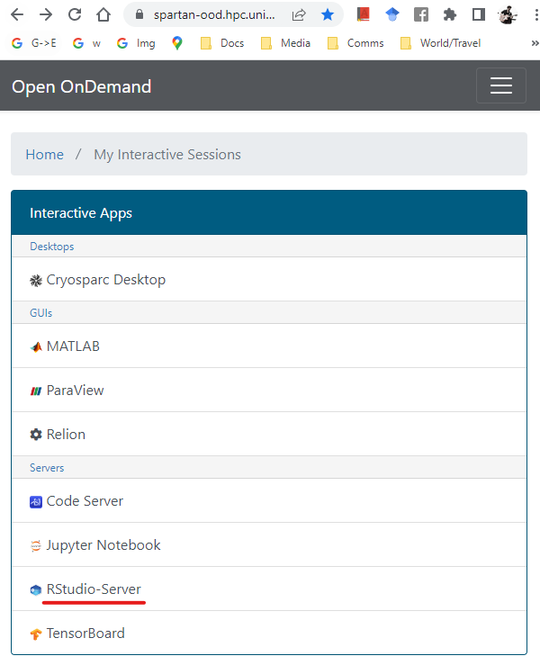
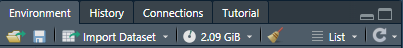
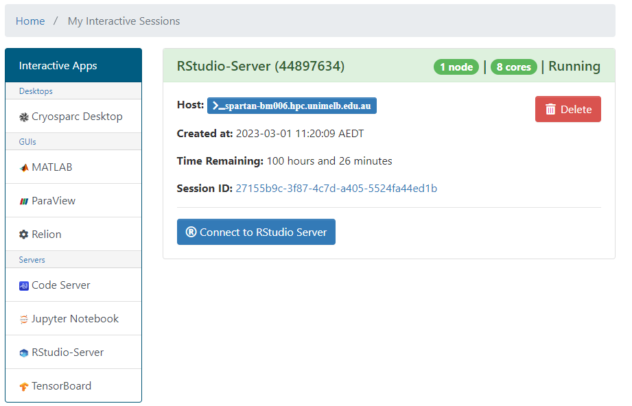

## The Dashboard

To work in an R studio IDE in the HPC environment, head over to the spartan [Open OnDemand Dashboard](https://spartan-ood.hpc.unimelb.edu.au/pun/sys/dashboard/batch_connect/sessions), and select Rstudio-server from the list.

## Settings

This will take you to a settings screen. Here's what to enter:

- *Account* --- punim1869

- *R_LIBS_USER directory* --- This is where your R packages are installed to by default. If you followed the [suggested set up](./getting_started.html), you will have a directory set up for this purpose at `/data/gpfs/projects/punim1869/users/<YOUR_USERNAME>/.R_PACKAGES`.

- *RStudio Version* --- Use the latest version (top of the list). This also loads a recent [foss toolchain](tutorial_module.html).
 At the moment 
- *Load extra module* --- If you call shell programs from the R session (or using the terminal built in to Rstudio), you will need the relevant modules loaded. Type the module identifiers here. For example I normally set it to `harfbuzz/2.8.2 fribidi/1.0.10 blast+/2.12.0 bedtools/2.30.0 bcftools/1.15 vcftools/0.1.16 samtools/1.16.1 lastz/1.04.03`.

- *Number of hours* --- If you request a short time, your session will be approved faster. I tend to use 12 hour sessions, they get accepted within a few minutes.

- *Number of CPU cores* --- Use more if the functions/packages/scripts you use request multiple cores. The package `mcparallel` makes it super easy to write "loops" that run code in parallel and can really speed up your work. I use 4 cores by default and up to 50 if I am making heavy use of multi-core functions.

- *Partition* --- "Physical" tends to provide resources faster.

- *QoS* --- Leave blank

- *Number of GPUs* --- Use more if the functions/packages/scripts you use are specifically written to make use of GPUs.

- *Amount of RAM allocated to job* --- The RAM has to fit all the combined objects you are working on, including any plots. If you have beg tables with millions of rows or very complex plots, this will easily exceed 50 Gb. But for normal usage 8 to 16 is fine. You can see the memory usage of a session in the <environment> tab of the upper right window:

- *Email address* --- If you want.

Click "Launch"!

## Connecting a session

You'll be sent back to the dashboard. Once the session has started, just click Connect to open an Rstudio server session in your browser.

## Other notes

1) The package data.table will change your life.