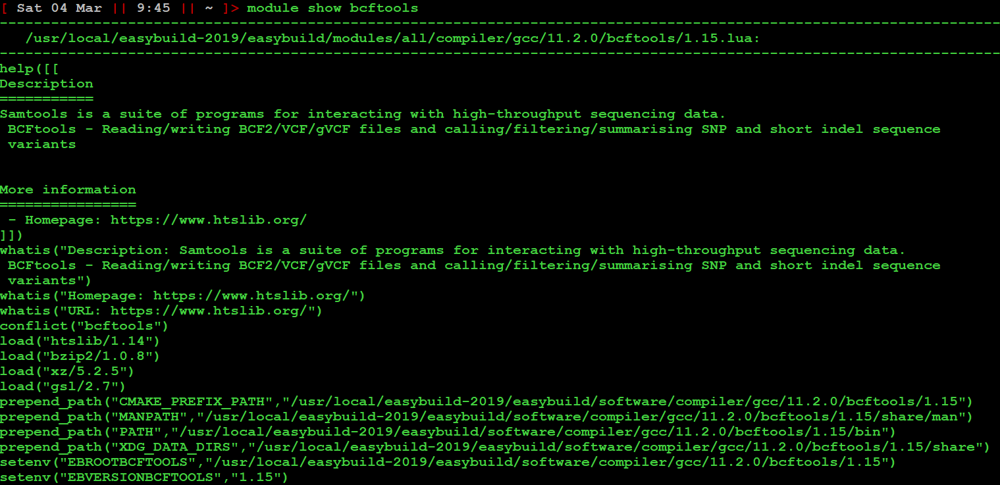
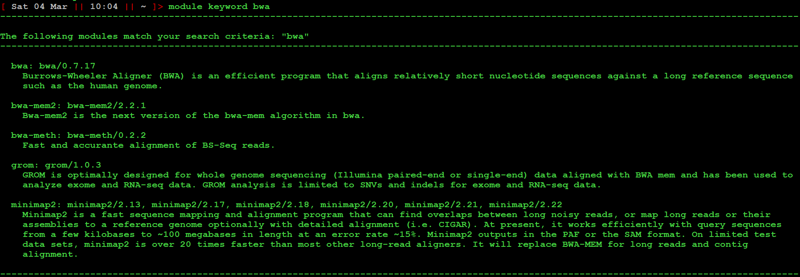
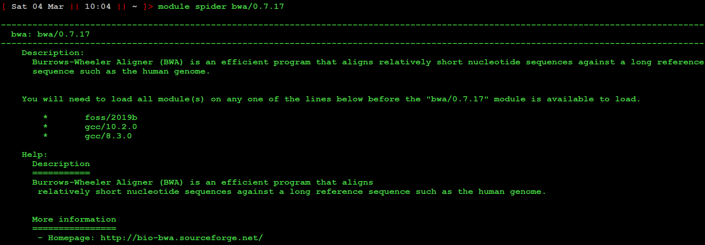
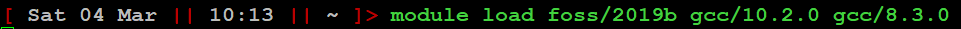
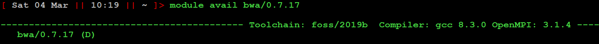
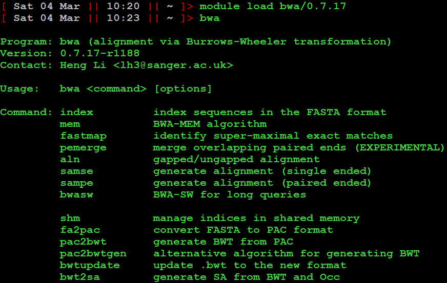

## Background

### Environment Modules

To run properly, programs often need the shell environment to be set up. They might, for example, need certain shell variables to be set. As an example, the shell Zsh uses a cache directory to store temporary things in, and it finds it by setting a variable called ZSH_CACHE_DIR to the address in your environment. You can even see what is stored in it under your particular configuration:

One important shell variable that will normally need to be set correctly is the variable `$PATH`, which contains a list of all the places executable programs are stored. To run a program, its location must be in this list. You can have a look at your path list any time with `echo $PATH`, and even edit it manually! It might also be useful for a command to link to a particular *version* of a program, for example, what if your default `BLASTn` command invokes BLASTn v2.9.0, but you want to replicate the exact result you got from an analysis you ran with BLASTn v1.2.3?

Environment Modules are a way of setting up your shell so it's ready to run a program. They also do other useful things like checking for conflicts between different the environment requirements of different programs, and so on. These conflicts can be a real problem when you consider that one thing programs often need in their environment is ... other programs. So when you request a module loaded, it will likely result in a whole tree of dependent modules being loaded with it.

Now---what happens if one of these needs to use BLASTn v2.9.0, and another needs BLASTn v1.2.3? When one of these program calls BLASTn ... it may get a version different to what it expected. Or one version of BLASTn might find the environment variables it depends upon are now wrong. This is a conflict.

### Toolchains

Often many programs (or "tools") require similar prerequisites, so module groups them together into common *toolchains*. Conventionally, admins try to set up toolchains such that every program in it will run with every other program without conflicts.

### Module files

Behind each module is just a file containing a set of instructions describing the module. and what to do when the module is loaded. To see one, use the command `module show <module_name>`. Here is the module file for bcftools.

Browsing it, we see some descriptions, some links to more information, and---no surprises here---the loading of some other modules (`load(...)`), the setting of some environment variables (`setenv(...)`) including the path (`prepend_path(...)`), that allow the program bcftools to run.

## Using Modules

Let's run a typical example of getting the modules loaded to run a program, bwa, an alignment program normally used to map short read sequence data.

Here are the commands you need to know:

1) `module keyword <search>` :  Perform a search for modules whose names contain a match to `<string>`

We have found a module we want --- it's the first one. As you can see,  module identifiers follow a [name]/[version] syntax.

2) `module spider <module_name>` : Get information about how to load a specific module, including what other keychains / modules will be needed.

As we can see, three other modules are required. Before bcftools will become available. In this case (for anyone who cares), they provide access to libraries of code associated with the foss ("Free and Open Source Software") and gcc (GNU C compiler) toolchains.

3) `module load <module_name_1> <module_name_2>` : Load the modules.

4) `module avail <module_name>` : List module versions available for loading. Only modules that have the required prerequisites will be listed. This is basically a check to make sure step 3) worked.

5) `module load <module_identifier>` : Load the module you want.

It works!

## Tips

1) You can load up all your prerequisite toolchains and the module in one command. Just write `module load`, followed by any prerequisites, followed by the modules you want.

2) If you use the same modules a lot, put your module loading commands in a script. **IMPORTANT:** To use the script, you cannot just run it. Scripts by default start their own environments, but you probably want the modules loaded in your current, interactive environment. To execute a script in the current environment, use `source <script_name>`.