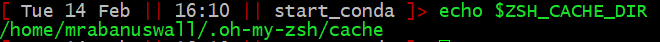

## Background

### Environment Modules

To run properly, programs often need the shell environment to be set up. They might, for example, need certain shell variables to be set. As an example, the shell Zsh uses a cache directory to store temporary things in, and it finds it by setting a variable called ZSH_CACHE_DIR to the address in your environment. You can even see what is stored in it under your particular configuration:

Other times it might be useful for a command to link to a particular version of a program, for example, what if your default BLASTn is v2.9.0, but you want to replicate the exact result you got from an analysis you ran with BLASTn v1.2.3?

Environment Modules are a way of setting up your shell so it's ready to run a program. They also do other useful things like reset the shell once you're done, checking for conflicts between different the environment requirements of different programs, and so on. These conflicts can be a real problem when you consider that one thing programs often need in their environment is ... other programs. So when you request a module loaded, it will likely result in a whole tree of dependent modules being loaded with it.

Now---what happens if one of these needs to use BLASTn v2.9.0, and another needs BLASTn v1.2.3? When one of these program calls BLASTn ... it may get a version different to what it expected. Or one version of BLASTn might find the environment variables it depends upon are now wrong. This is a conflict.

### Toolchains

Often many programs (or "tools") require similar prerequisites, so module groups them together into common *toolchains*. Conventionally, admins try to set up toolchains such that every program in it will run with every other program without conflicts.

An example might be more clear. The toolchain foss/2021b.lua (foss for "Free Open Source Software") on Spartan can be loaded with `module load foss/2021b.lua`. Following this, we can see what modules it loads.

