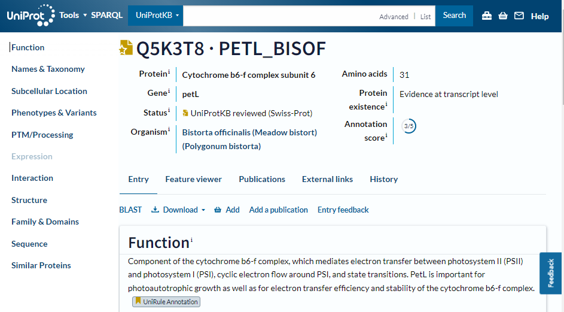
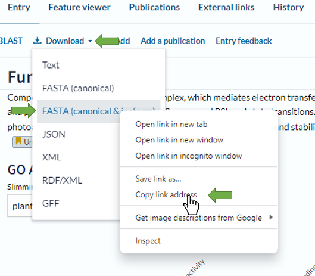
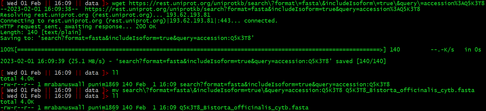
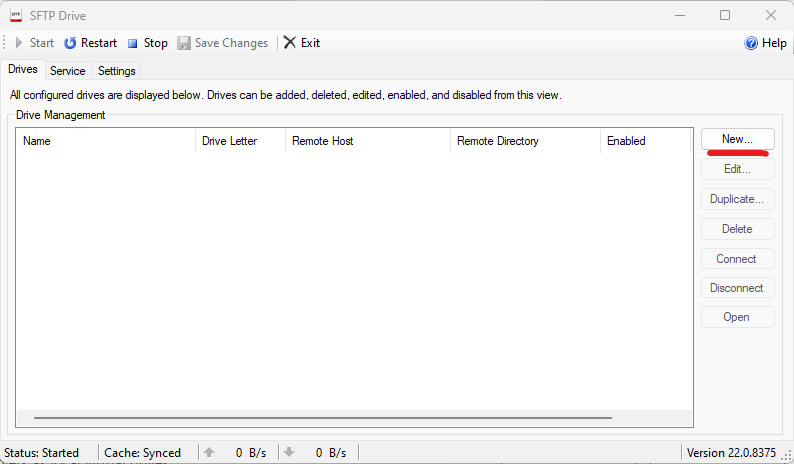
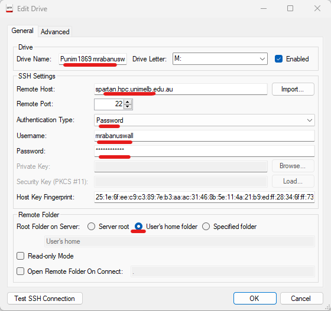
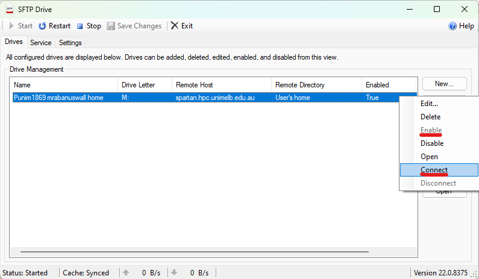
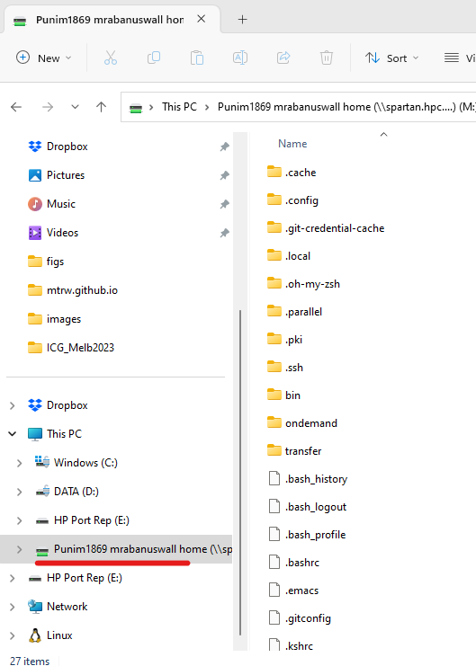
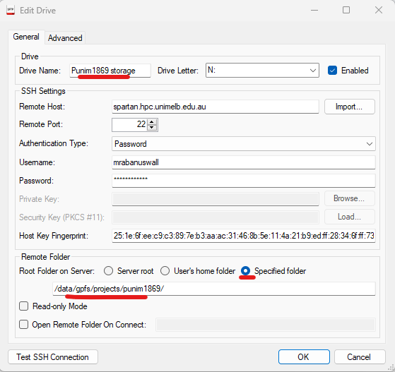
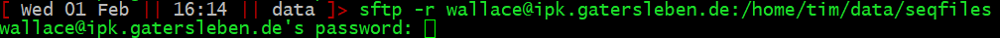

## Background

At some stage you will want to transfer data to or from Spartan, either from your desktop computer or from the internet or from another server. Perhaps ... :

+   You produced a figure or table, and you want to edit in a windows program like Excel.
+   You've found a publicly available genome on the internet and you want to work with it.
+   You want to share some data that a colleague at another institution has on their cluster.
+   Your project is finished, and you want to archive all the data and free up storage space on Spartan.

Here's how you do it.

## Transferring from the internet to Spartan using a URL and `wget`

The Linux program `wget` ([w]eb [get]) is a good first bet. It's as simple as finding the URL or download link of the thing you want, and giving it to `wget` as the first argument.

For example, pretend I want this Cytochrome b sequence from UniProt:

I find the download link and copy the URL by right-clicking it:

Then use `wget` with the URL (which happens to be *https://rest.uniprot.org/uniprotkb/search?format=fasta&includeIsoform=true&query=accession%3AQ5K3T8*)

As you can see I now have the file. `wget` gives it a name taken from the URL, so I rename it. Simple.

## Transferring between your desktop and Spartan

This is where we use the program [SFTP Drive 2022](https://www.nsoftware.com/sftp/drive/download.aspx). Which implements a [s]ecure [f]ile [t]ransfer [p]rotocol under the bonnet, but applies some sexy wrapping to make it operate just like a regular directory on your own computer. Open SFTP Drive 2022 and click <new>.

Then set up a connection to spartan. First, make a connection to your home directory. Just fill it out and check boxes as shown below where underlined, the rest will fill automatically. You can enter any name you want, and use your spartan username and password.

Click Ok. The system may ask permission to access the registry -- click yes.

Right click the drive and click enable if it is disabled. Then right click again and click connect.

Assuming that's all fine, you will now have your spartan home directory accessible as a drive, e.g. in Windows explorer:

To add a drive that directly takes you to storage, simply repeat the process and configure the drive like this:

Excellent. You can now delete, create, move, copy, and open files from your desktop. But if you are learning, remember: if there is a task you *can* do in Linux, **make yourself do it in Linux**. Once you've developed comfort with it, almost everything will be faster in Linux.

## Transferring from server to server

A good way to do this is with the Linux `sftp` program, which implements a [s]ecure [f]ile [t]ransfer [p]rotocol for files and directories.

The command syntax is:

                sftp <login_name>@<other.server.address>:</path/on/other/server/to.file>

If you want to copy directories and all their subdirectories, add the -r flag:

                sftp -r <login_name>@<other.server.address>:</path/on/other.server/to/directory>

So, say I am on Spartan and I want to copy a directory **/home/tim/data/sequences** from the server at my old work (where my username is **wallace**, the server address is **ipk-gatersleben.de**, and my password is of course a secret) I would run:

... and enter my password, and the directory will be downloaded.

Note sftp will follow symlinks (shortcuts) and copy the original file. This is actually a great way to transfer many files: Put a directory of shortcuts to all the files on one server, and sftp the whole directory from the other server.

Also, in reality most servers won't let you directly copy files from them, and Spartan is no exception. When you want to transfer between servers, the admins will set up a special *ftp server* for you, and you can transfer files to and from that exactly as above. If you need to use an ftp server, talk to the mighty admins.

