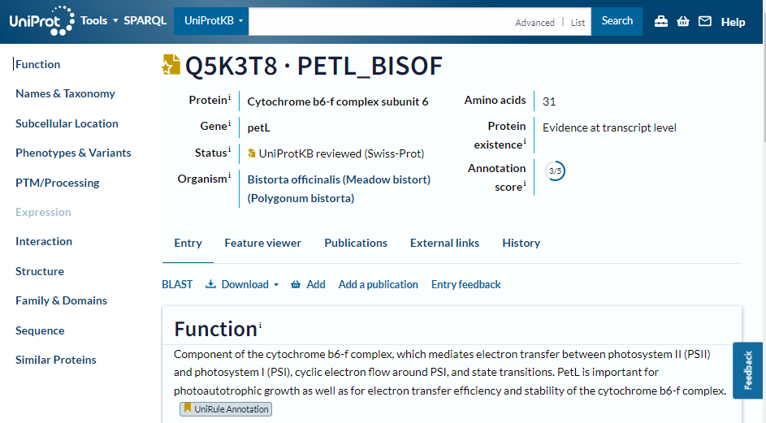
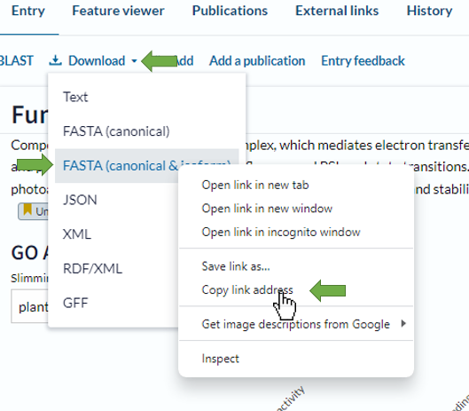
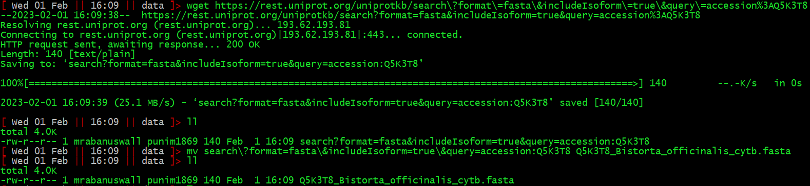
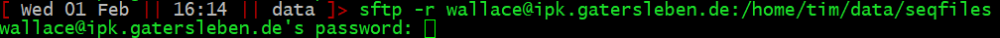

If you are looking for the guide on mac go [here](./tutorial_sftp_mac.html).

## Background

At some stage you will want to transfer data to or from Spartan, either from your desktop computer or from the internet or from another server. Perhaps ... :

+   You produced a figure or table, and you want to edit in a windows program like Excel.
+   You've found a publicly available genome on the internet and you want to work with it.
+   You want to share some data that a colleague at another institution has on their cluster.
+   Your project is finished, and you want to archive all the data and free up storage space on Spartan.

Here's how you do it.

## Transferring from the internet to Spartan using a URL and `wget`

The Linux program `wget` ([w]eb [get]) is a good first bet. It's as simple as finding the URL or download link of the thing you want, and giving it to `wget` as the first argument.

For example, pretend I want this Cytochrome b sequence from UniProt:

I find the download link and copy the URL by right-clicking it:

Then use `wget` with the URL (which happens to be *https://rest.uniprot.org/uniprotkb/search?format=fasta&includeIsoform=true&query=accession%3AQ5K3T8*)

As you can see I now have the file. `wget` gives it a name taken from the URL, so I rename it. Simple.

## Transferring between your desktop and Spartan

Mac users go [here](./tutorial_sftp_mac.html).

This is where we use the free program [WinSCP](https://winscp.net/download/WinSCP-6.5.6-Setup.exe/download), Which implements a [s]ecure [f]ile [t]ransfer [p]rotocol. STFP is basically a set of rules governing how computers can securely transfer data between them. There are command line programs that implement SFTP, but SFTP Drive applies some sexy wrapping to make it operate just like a regular directory on your own computer!

First, install WinSCP if you haven't already.

Open WinSCP. If you have already set up PuTTy it may ask you if you would like to import login details from there. By all means do. Otherwise, click New Site, and enter your Spartan username and other settings similar to what you see below. The host name should be 'spartan.hpc.unimelb.edu.au'. You do have the option to enter and save a password, which is not really best practice for security reasons but ... you can.

Then click Advanced, and navigate to the Environment/Directories pane, and set the remote directory (where you will land on the server). If you want to go to your own working directory, for instance, set it to '/data/gpfs/projects/punim1869/<your username>/'. You can also change the Local Directory to wherever you wish to land on your local system. Click Ok.

Then click the Save button and give the session a name under 'Site Name'. 'Spartan workspace', for example. Click Ok.

Now click 'Login' to connect. If it asks you about a host key, click Accept. If all is well you'll get something like this:

Excellent. On the left is your local computer, on the right is the Spartan cluster. You can now delete, create, move, copy, and open files from your desktop. But if you are learning, remember: if there is a task you *can* do in Linux, **make yourself do it in Linux**. Once you've developed comfort with it, almost everything will be faster.

## Faster login

If you don't want to type your password in every time you connect, here's a homework challenge. Learn about SSH keys, and set one up with WinSCP. This will allow you to securely log in with a single click.

## Transferring from server to server

A good way to do this is with the Linux `sftp` program, which implements a [s]ecure [f]ile [t]ransfer [p]rotocol for files and directories.

The command syntax is:

                sftp <login_name>@<other.server.address>:</path/on/other/server/to.file>

If you want to copy directories and all their subdirectories, add the -r flag:

                sftp -r <login_name>@<other.server.address>:</path/on/other.server/to/directory>

So, say I am on Spartan and I want to copy a directory **/home/tim/data/seqfiles** from the server at my old work, IPK (where my username is **wallace**, the server address is **ipk-gatersleben.de**, and my password is of course a secret) I would run:

... and enter my password, and the directory will be downloaded.

Also, in reality most servers won't let you directly copy files from them, and Spartan is no exception. When you want to transfer between servers, the admins will set up a special *ftp server* for you, and you can transfer files to and from that exactly as above. If you need to set up an ftp server, talk to the mighty admins.

