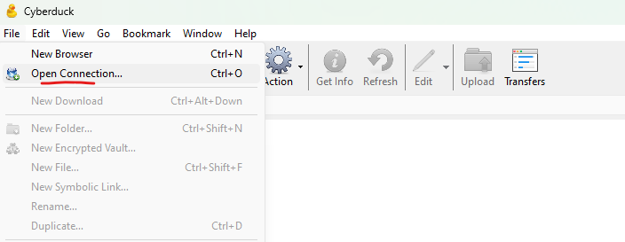
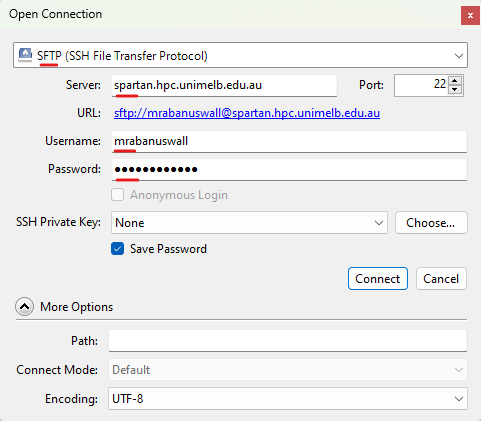
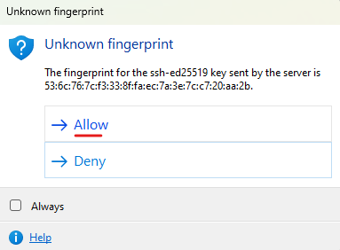
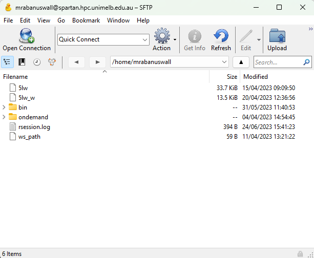
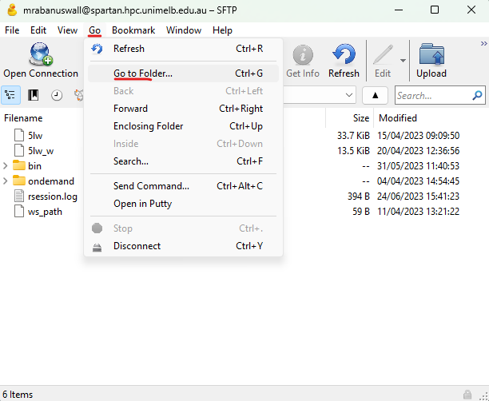
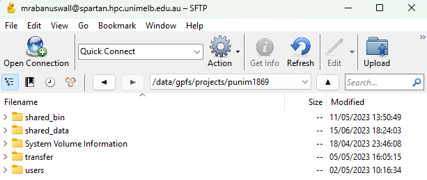

If you are looking for the guide on PC go [here](./tutorial_sftp.html).

To access files on Spartan on a Mac desktop, we can use the program [Cyberduck](https://cyberduck.io/download/), which implements a [s]ecure [f]ile [t]ransfer [p]rotocol. STFP is basically a set of rules governing how computers can securely transfer data between them. There are command line programs that implement SFTP, but SFTP Drive applies some sexy wrapping to make it operate just like a regular directory on your own computer!

First, install Cyberduck for mac from [here](https://cyberduck.io/download/).

Then open Cyberduck and go to 'file' --> 'open connection'.

Then configure your connection to Spartan as I have below, using your Spartan username and password.

... then click 'Connect'.

It may ask you about an unknown fingerprint, in which case click 'allow'.

You are now in your *home directory*. You can store, modify, or delete any files in here.

To access the shared storage space, click 'Go' --> 'Go To Folder'

Then navigate to `/data/gpfs/projects/punim1869/`

You can now see the shared data directories including `shared_data` (for reference genomes etc.) and `shared_bin` (for software and scripts).

> Important! Please do not save files in this directory!

If you want to save files on the Spartan storage, you need to create your own workspace (see section 'Storage and your workspace' [here](./getting_started.html)):

1) Go to /data/gpfs/projects/punim1869/users
2) Create a directory with the same name as your username

You can now save files here. Remember, Spartan is not intended for long-term storage, just for ongoing projects. If you are no longer actively working on your data, move it to mediaflux (tutorial [here](./tutorial_mediaflux.html)).