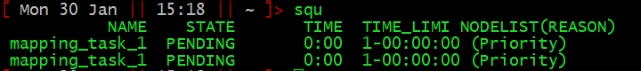
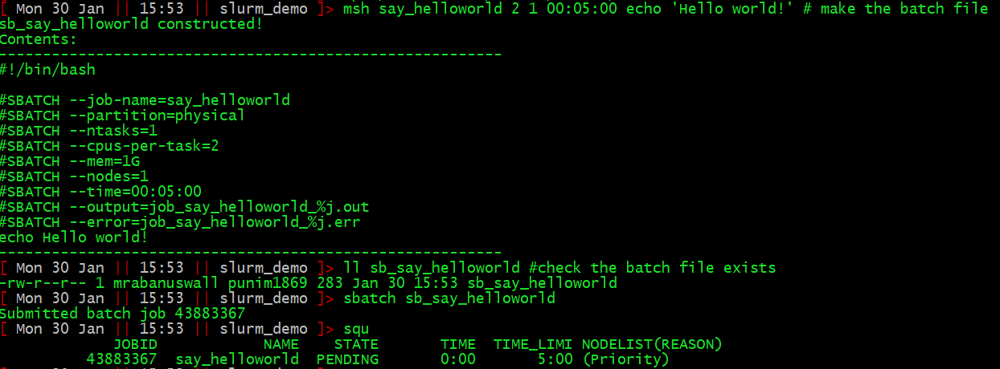
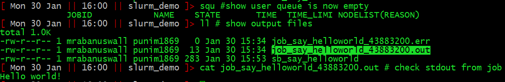
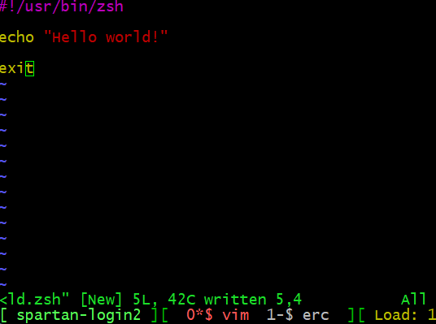
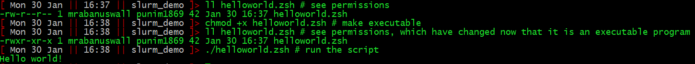
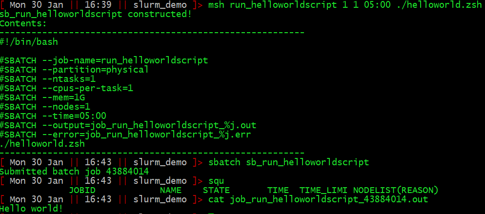

## Background

The HPC cluster is a shared resource. The memory and CPUs it has need to be shared. To make this happen, a program called *slurm* runs on the cluster and acts as the central resource access coordinator. To run some job on the cluster, you submit a request to slurm, that contains the command(s) you want to run, along with a request for a certain amount of resources.

## Setup

Make sure you have the most recent version of the .zsh profile file. Note: **This will overwrite your existing zsh profile file**, so if you've made changes, be sure to save and integrate them properly.

        cd /home/$USER
        [[ -e .zshrc ]] && mv .zshrc .zshrc_old
        cp /data/gpfs/projects/punim1869/.admin/assets/.zshrc .
        source ./.zshrc

## Slurm batch files

This request is in the form of a text file called a *slurm batch file*. Let's say I wanted to map `reads.fastq` to `genome.fasta` using the aligner `minimap2`. A command to do this might be:

        minimap -a -x sr reads.fastq genome.fasta > reads_to_genome.sam

To do this quickly, it would be useful to have quite a lot of capacity for parallel computing (say, 25 CPU cores), and and also a lot of memory (say, 10Gb RAM). A slurm batch file to request this task would contain this text:

        #!/bin/bash
        #SBATCH --job-name=mapping_task_1
        #SBATCH --partition=physical
        #SBATCH --ntasks=1
        #SBATCH --cpus-per-task=25
        #SBATCH --mem=10G
        #SBATCH --nodes=1
        #SBATCH --time=1-0
        #SBATCH --output=job_mapping_task_1_%j.out
        #SBATCH --error=job_mapping_task_1_%j.err
        minimap -a -x sr reads.fastq genome.fasta > reads_to_genome.sam

As you can see, it's just a bash script (more on them later if you don't understand yet). It begins with the interpreter directive (`#!/bin/bash`) marking it as a bash script, and ends with the command(s) we want to run. In between, the instructions to slurm are marked with the prefix `#SBATCH`, followed by `--<argument-name>=<argument>`.

The most important are:

  +   job-name: A handy name to refer to your job, useful to identify it in a list of jobs
  +   cpus-per-task: The number of CPUs you want
  +   mem: The amount of RAM you want
  +   time: The maximum time required. Two common formats are `<days>-<hours>` and `<hours>:<minutes>:<seconds>`.

After the `time` has elapsed, the job can be stopped and the resources freed for other users, so be sure to request more than you need. It is possible to request extended time for a running job in cases where your estimate was too little.

## Output, and slurm vs. stdout/stderr

Typically your scripts will produce some file and that's all you want. Job done, hit the showers.

However, Linux programs will often output things to either *stdout* or *stderr*. Once your job is complete, any output to these will be given in two files `job_<job-name>.out` and `job_<job-name>.err`.

## Writing slurm batch files made easy with the `msh()` function and shell scripts.

You could use a text editor (like `vim`) to type out everything every time you want to make a slurm batch file and run a job. But that is a bit time consuming. I have provided a simple shell function `msh` ([m]ake [s]lurm [h]eader). You use it with the following syntax:

        msh <job_name> <CPUs> <RAM_in_Gb> <time_formatted_for_slurm> <the commands you want to run>

It will create a slurm batch file named `sb_<job_name>` automatically.

See the example below in the section *A simple workflow example*.

## Submitting the request

Let's say the above slurm batch file was saved as sb_mapping_task_1. To submit it, simply use the command `sbatch <filename>` (so, `sbatch sb_mapping_task_1`).

Slurm will put your request in a queue and allocate resources based on how large your request was, when it was submitted, etc. It tries to be intuitively fair according to parameters controlled by the admins, making them the cosmic arbiters of morality in HPC computing.

See the example below in the section *A simple workflow example*.

## Checking your request/job progress

The command `squeue` will display a list of all running or pending jobs.

`squeue -u <your_username>` will show only your jobs.

I have provided a shortcut `squ` ([s]lurm [q]ueue [u]ser) which quickly prints the information for the user's requests, formatted nicely:

Here, you can see which jobs are in the queue (NAME), whether they are pending or running (STATE), how long they have been running for (TIME), and how long they have been given (TIME_LIMIT).

Time for an example.

## A simple workflow example

So, here is the process for writing, submitting, and monitoring, a job called "say_helloworld" that simply prints "Hello world!" to stdout:

Once the job has run, the output to stdout will be in job_say_helloworld.out.

## Deleting requests

If you want to delete requests, `scancel <job-id>` can be used. I have provided a shell alias to cancel all your jobs: `sqk` ([s]lurm [q]ueue [k]ill). To see what it actually does, explore your ~/.zshrc, or type `alias sqk`.

## Use shell scripts

You will quickly realise it is hard to use `msh` when your command is complex, especially if it contains lots of quotes or redirections or pipes, or multiple lines.

Moreover, you will find developing pipelines really hard if EVERY time you run it you need to make and submit a batch file. Part of this problem is overcome by running [interactive sessions](./tutorial_slurm_interactive.html). The other part is packaging your commands into shell scripts.

A script is just a list of commands for the shell to run. You can make them with any text editor. Notepad is ok. Vim (which can be used from the command line, just type `vim`) is excellent, but harder to learn. Komodo Edit is an excellent compromise.

There are only two things you need to know to put your commands into a script.

1.    The first line of a Linux script is traditionally where you put the *interpreter directive*, and it states essentially what language the script contains, and hence how it should be interpreted. It is identified by a *shebang* ("ha[sh]+[bang]") symbol: `#!` followed by a path to the appropriate interpreter. You will frequently see for example `#!/bin/bash`, `#!/usr/bin/zsh`, `#!/usr/bin/awk`, `#!/bin/perl`, etc.
        +   NOTE: Scripts are traditionally given an extension to reflect their interpreter, e.g., my_script.zsh or map_reads.pl (for a perl script).
2.    Linux needs to be told the file is a script, by **ch**anging the **mod**e using the `chmod` command. Simply type `chmod +x <file_name>` to make your file into an executable script.

The following pipeline shows how I can examine, and then run, a simple hello world zsh script.

First, I write the script, here I have used vim, and saved it as `helloworld.zsh`

Then we make it executable and run it:

That's all you need to know to get started. To write advanced shell scripts requires learning more of the bash/zsh language. But you're now in a position to use slurm to run shell scripts rather than sending your commands directly.

## Automating request submission

Frequently we want to request a lot of jobs, say, when we want to map `reads.fastq` to `ref_1.fasta`, and `ref_2.fasta` and `ref_3.fasta` and ... etc. up to `ref_100.fasta`.

To do it, use loops to create and submit jobs (or use GNU parallel if you want to be super hip). For now I will leave this as a challenge for you, but will expand this tutorial on request.